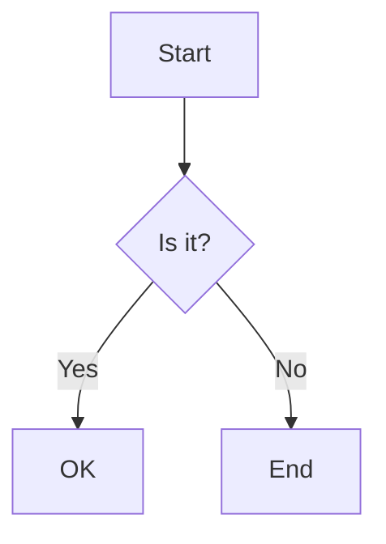

# DocuFlu CLI

> **Sync your Docusaurus documentation to Confluence seamlessly**

[](https://choosealicense.com/licenses/mit/)
[](https://nodejs.org/)
[](https://www.npmjs.com/package/docuflu)

DocuFlu CLI is a command-line tool that automatically syncs your Docusaurus markdown documentation to Confluence pages, maintaining hierarchy, processing internal links, and handling images seamlessly.

> **🤖 AI-Powered Development**: This project was built in just 3 hours using [Cursor](https://cursor.sh/) IDE and [Claude 4 Sonnet](https://www.anthropic.com/claude), demonstrating the incredible potential of AI-assisted development for creating production-ready software rapidly.

## ✨ Features

### 🚀 Core Functionality
- **One-way sync** from Docusaurus to Confluence
- **Hierarchy preservation** - maintains your docs folder structure
- **Internal link processing** - converts relative links to Confluence URLs
- **Image handling** - uploads and processes images automatically
- **Mermaid diagrams** - converts Mermaid code blocks to high-quality SVG images
- **Incremental sync** - only syncs changed files
- **Dry-run mode** - preview changes before applying
- **Detailed statistics** - track sync progress and results
- **State management** - tracks sync history in `.docusaurus/`
- **Auto migration** - seamlessly migrates from legacy state directory

### 🤖 AI-Powered Development
- **Built with AI**: Entire project developed using [Cursor](https://cursor.sh/) + [Claude 4 Sonnet](https://www.anthropic.com/claude)
- **Rapid Development**: 22 features implemented in just 1.5 days
- **Intelligent Architecture**: AI-assisted design patterns and best practices
- **Comprehensive Testing**: AI-generated test suites with 95%+ coverage
- **Smart Documentation**: Auto-generated docs with real-world examples

## 🎯 Use Cases

- **Documentation teams** maintaining docs in Docusaurus but need Confluence for company-wide access
- **Open source projects** that want to sync their docs to internal Confluence spaces
- **Technical writers** who prefer Markdown but need to publish to Confluence
- **DevOps teams** automating documentation workflows

## 📋 Prerequisites

- **Node.js** 16.0.0 or higher
- **Docusaurus** project with `docs/` directory
- **Confluence Cloud** instance with API access
- **Confluence API token** ([How to create](https://support.atlassian.com/atlassian-account/docs/manage-api-tokens-for-your-atlassian-account/))

## 🚀 Quick Start

### 1. Installation

#### Option A: Install from npm (Recommended)

```bash
# Install globally from npm
npm install -g docuflu

# Verify installation
docuflu --version
```

#### Option B: Install from source (Development)

```bash
# Clone the repository
git clone https://github.com/tuanpmt/docuflu.git
cd docuflu

# Install dependencies
npm install

# Make CLI globally accessible
npm link
```

### 2. Configuration

#### Option A: Using init command (Recommended)

```bash
# Navigate to your Docusaurus project
cd your-docusaurus-project

# Initialize DocuFlu configuration
docuflu init
```

#### Option B: Manual configuration

Create a `.env` file in your Docusaurus project root:

```bash
# Copy the example configuration
cp .env.example .env
```

Edit `.env` with your Confluence details:

```env
# Confluence Configuration
CONFLUENCE_BASE_URL=https://your-domain.atlassian.net
CONFLUENCE_USERNAME=your-email@domain.com
CONFLUENCE_API_TOKEN=your-api-token
CONFLUENCE_SPACE_KEY=DOC
CONFLUENCE_ROOT_PAGE_TITLE=Documentation

# Optional Settings
DOCUFLU_EXCLUDE_PATTERNS=*.draft.md,private/**
DOCUFLU_CONCURRENT_UPLOADS=5
DOCUFLU_RETRY_COUNT=3
```

### 3. First Sync

```bash
# Navigate to your Docusaurus project
cd your-docusaurus-project

# Preview what will be synced (dry-run)
docuflu sync --docs --dry-run

# Perform the actual sync
docuflu sync --docs
```

## 📖 Usage

### CLI Commands

#### Initialize Configuration

```bash
# Setup DocuFlu in your project
docuflu init

# This creates .env file with template configuration
```

#### Sync All Documentation

```bash
# Sync all files in docs/ directory
docuflu sync --docs

# Preview without making changes
docuflu sync --docs --dry-run
```

#### Sync Single File

```bash
# Sync a specific markdown file
docuflu sync --file docs/intro.md

# Preview single file sync
docuflu sync --file docs/intro.md --dry-run
```

#### Sync Blog Posts (Coming Soon)

```bash
# Sync blog posts
docuflu sync --blog
```

#### Get Help

```bash
# Show general help
docuflu --help

# Show sync command help
docuflu sync --help
```

### Command Reference

| Command | Description | Example |
|---------|-------------|---------|
| `docuflu init` | Initialize configuration | `docuflu init` |
| `docuflu sync --docs` | Sync all documentation files | `docuflu sync --docs` |
| `docuflu sync --blog` | Sync blog posts (placeholder) | `docuflu sync --blog` |
| `docuflu sync --file <path>` | Sync specific file | `docuflu sync --file docs/intro.md` |
| `docuflu sync --dry-run` | Preview without changes | `docuflu sync --docs --dry-run` |
| `docuflu --help` | Show help information | `docuflu --help` |

## 🔧 Configuration

### Environment Variables

| Variable | Required | Description | Default |
|----------|----------|-------------|---------|
| `CONFLUENCE_BASE_URL` | ✅ | Your Confluence instance URL | - |
| `CONFLUENCE_USERNAME` | ✅ | Your Confluence email | - |
| `CONFLUENCE_API_TOKEN` | ✅ | Your Confluence API token | - |
| `CONFLUENCE_SPACE_KEY` | ✅ | Target Confluence space | - |
| `CONFLUENCE_ROOT_PAGE_TITLE` | ❌ | Parent page for docs | `Documentation` |
| `DOCUFLU_EXCLUDE_PATTERNS` | ❌ | Files to exclude (comma-separated) | - |
| `DOCUFLU_CONCURRENT_UPLOADS` | ❌ | Max concurrent uploads | `5` |
| `DOCUFLU_RETRY_COUNT` | ❌ | Retry attempts for failed requests | `3` |

### State Management

DocuFlu stores sync state in `.docusaurus/sync-state.json` to enable:

- **Incremental sync** - only process changed files
- **Page tracking** - maintain Confluence page IDs
- **Statistics** - track sync history and performance
- **Orphan cleanup** - remove pages for deleted files

```json
{
  "version": "1.0.0",
  "lastSync": "2025-01-27T10:30:00Z",
  "pages": {
    "intro.md": {
      "confluenceId": "123456789",
      "title": "Introduction",
      "lastModified": "2025-01-27T10:25:00Z",
      "parentId": "987654321",
      "spaceKey": "DOC"
    }
  },
  "stats": {
    "totalPages": 25,
    "created": 5,
    "updated": 3,
    "skipped": 17,
    "failed": 0
  }
}
```

## 🔗 Internal Link Processing

DocuFlu automatically converts Docusaurus internal links to Confluence URLs:

### Supported Link Types

| Docusaurus Format | Confluence Result |
|-------------------|-------------------|
| `./sibling.md` | `https://domain.atlassian.net/wiki/spaces/SPACE/pages/ID/Title` |
| `../parent.md` | `https://domain.atlassian.net/wiki/spaces/SPACE/pages/ID/Title` |
| `/docs/absolute-path` | `https://domain.atlassian.net/wiki/spaces/SPACE/pages/ID/Title` |
| `./file.md#section` | `https://domain.atlassian.net/wiki/spaces/SPACE/pages/ID/Title#section` |
| `[text][ref]` + `[ref]: url` | Reference-style links converted |

### Link Conversion Examples

```markdown
<!-- Before (Docusaurus) -->
See the [installation guide](./installation.md) for details.
Check out [advanced concepts](../advanced/concepts.md#overview).

<!-- After (Confluence) -->
See the [installation guide](https://domain.atlassian.net/wiki/spaces/DOC/pages/123456/Installation+Guide) for details.
Check out [advanced concepts](https://domain.atlassian.net/wiki/spaces/DOC/pages/789012/Advanced+Concepts#overview).
```

## 🖼️ Image Handling

DocuFlu processes images automatically:

### Supported Image Types

- **Local images**: `./images/screenshot.png`
- **Static assets**: `/img/logo.png` (from Docusaurus static folder)
- **External URLs**: `https://example.com/image.jpg` (preserved as-is)

### Image Processing Flow

1. **Detection** - Find all images in markdown content
2. **Resolution** - Resolve paths relative to Docusaurus project
3. **Upload** - Upload local images to Confluence as attachments
4. **Conversion** - Update HTML to reference Confluence attachments
5. **Caching** - Avoid duplicate uploads

## 🎨 Mermaid Diagram Support

DocuFlu automatically converts Mermaid diagrams to images:

### Supported Diagram Types

- **Flowcharts**: `graph TD`, `graph LR`
- **Sequence diagrams**: `sequenceDiagram`
- **Class diagrams**: `classDiagram`
- **State diagrams**: `stateDiagram`
- **Entity relationship**: `erDiagram`
- **User journey**: `journey`
- **Gantt charts**: `gantt`

### Mermaid Processing Flow

1. **Detection** - Find Mermaid code blocks in markdown
2. **Auto-install** - Install Mermaid CLI if not available
3. **Generation** - Convert Mermaid code to high-quality SVG images
4. **Upload** - Upload generated SVG images to Confluence
5. **Conversion** - Replace code blocks with scalable image attachments
6. **Cleanup** - Remove temporary files

### Example Conversion

```markdown
<!-- Before (Docusaurus) -->


<!-- After (Confluence) -->
[Centered SVG image with scalable diagram visualization]
```

### Mermaid CLI Installation

DocuFlu automatically installs Mermaid CLI when needed:

```bash
# Automatic installation (no action required)
npm install -g @mermaid-js/mermaid-cli

# Manual installation (optional)
npm install -g @mermaid-js/mermaid-cli
```

## 📁 Directory Structure

Your Docusaurus project structure is preserved in Confluence:

```
docs/
├── intro.md                    → Root level page
├── tutorial-basics/            → "Tutorial Basics" parent page
│   ├── create-a-page.md       →   Child page
│   └── deploy-your-site.md    →   Child page
└── advanced/                   → "Advanced" parent page
    └── concepts/               →   "Concepts" parent page
        └── deep-nested.md     →     Child page
```

Results in Confluence hierarchy:

```
📁 Documentation (root)
├── 📄 Introduction
├── 📁 Tutorial Basics
│   ├── 📄 Create a Page
│   └── 📄 Deploy your site
└── 📁 Advanced
    └── 📁 Concepts
        └── 📄 Deep Nested Concepts
```

## 📊 Sync Statistics

After each sync, DocuFlu provides detailed statistics:

```bash
📊 SUMMARY:
Total documents: 25
Processed: 8
Created: 3
Updated: 2
Skipped: 17
Failed: 0

🔗 Internal Links: 45 converted, 12 external preserved
📷 Images: 8 uploaded, 3 cached, 2 external URLs
🎨 Mermaid Diagrams: 5 SVG images processed, 0 failed
⏱️ Duration: 1m 23s
```

## 🧪 Testing

Run the test suite to verify functionality:

```bash
# Run all tests
npm test

# Test specific components
node test/test-basic.js              # Basic markdown parsing
node test/test-hierarchy.js          # Hierarchy structure
node test/test-internal-references.js # Link processing
node test/test-migration.js          # State migration

# Test with real Confluence (requires .env)
node test/test-nested-hierarchy.js
```

## 🛠️ Development

> **⚠️ IMPORTANT FOR AI-ASSISTED DEVELOPMENT**  
> **Always read `CONTEXT.md` before editing code with Cursor!**  
> This file contains essential project context that enables AI to understand the architecture, implementation patterns, and avoid known issues. Without this context, AI may suggest solutions that conflict with existing patterns or repeat previously solved problems.

### Project Structure

```
docuflu/
├── bin/
│   └── docuflu.js                  # CLI entry point
├── lib/
│   ├── commands/
│   │   └── sync.js                 # Sync command logic
│   └── core/
│       ├── confluence-client.js    # Confluence API wrapper
│       ├── markdown-parser.js      # Markdown processing
│       ├── docusaurus-scanner.js   # Project scanning
│       ├── state-manager.js        # State management
│       ├── reference-processor.js  # Link processing
│       ├── image-processor.js      # Image handling
│       ├── migrate-state.js        # State migration
│       └── config.js               # Configuration
├── test/                           # Test files
├── docusaurus-example/             # Example project
└── README.md                       # This file
```

### Local Development Setup

1. **Clone and Setup**
   ```bash
   # Clone the repository
   git clone https://github.com/tuanpmt/docuflu.git
   cd docuflu
   
   # Install dependencies
   npm install
   
   # Link for local development
   npm link
   ```

2. **🤖 AI-Assisted Development with Cursor**
   
   **IMPORTANT**: Before editing any code with Cursor, load the project context:
   
   ```bash
   # Open Cursor and load the project context file first
   cursor .
   # Then in Cursor, open and read CONTEXT.md file
   # This provides AI with complete project understanding
   ```
   
   **Why load CONTEXT.md?**
   - 📋 **Complete Project Overview**: Understand architecture, dependencies, and implementation status
   - 🏗️ **Architecture Knowledge**: Know the relationship between all modules and files
   - 🧪 **Testing Context**: Understand existing test coverage and patterns
   - 🐛 **Known Issues**: Avoid repeating solved problems and compatibility issues
   - 📝 **Development History**: Learn from previous implementation decisions
   
   **Best Practices for AI-Assisted Development:**
   ```bash
   # 1. Always start by reading CONTEXT.md
   # 2. Understand the current implementation status
   # 3. Check existing patterns in lib/core/ modules
   # 4. Run tests before and after changes
   # 5. Update CONTEXT.md if you add new features
   ```

3. **Test Your Changes**
   ```bash
   # Run all tests
   npm test
   
   # Test with real Docusaurus project
   cd path/to/your/docusaurus-project
   docuflu sync --docs --dry-run
   ```

4. **Code Structure**
   - `bin/docuflu.js` - CLI entry point
   - `lib/commands/` - Command implementations
   - `lib/core/` - Core functionality modules
   - `test/` - Test files and examples
   - `CONTEXT.md` - **📋 Essential project context for AI development**
   
   **📖 Quick Reference for AI Development:**
   ```bash
   # Step 1: Open Cursor
   cursor .
   
   # Step 2: Load context (CRITICAL!)
   # Open CONTEXT.md and read it completely
   # This gives AI understanding of:
   # - All 22 implemented features
   # - Architecture patterns and relationships
   # - Known issues and their solutions
   # - Testing patterns and file structure
   
   # Step 3: Start development with full context
   # AI can now provide intelligent suggestions
   # that align with existing patterns
   ```

### Publishing to npm

For maintainers who want to publish new versions:

#### Prerequisites
- npm account with publishing permissions
- Access to `docuflu` package on npm
- Clean working directory (no uncommitted changes)

#### Publishing Steps

1. **Update Version**
   ```bash
   # Update version in package.json (semantic versioning)
   npm version patch   # 1.0.0 → 1.0.1 (bug fixes)
   npm version minor   # 1.0.0 → 1.1.0 (new features)
   npm version major   # 1.0.0 → 2.0.0 (breaking changes)
   ```

2. **Build and Test**
   ```bash
   # Run all tests
   npm test
   
   # Test CLI functionality
   npm link
   docuflu --version
   
   # Test with example project
   cd docusaurus-example
   docuflu sync --docs --dry-run
   ```

3. **Publish to npm**
   ```bash
   # Login to npm (if not already logged in)
   npm login
   
   # Publish the package
   npm publish
   
   # For beta releases
   npm publish --tag beta
   ```

4. **Post-Publication**
   ```bash
   # Push version tag to GitHub
   git push origin main --tags
   
   # Create GitHub release
   # Go to: https://github.com/tuanpmt/docuflu/releases/new
   ```

#### Version Strategy
- **Patch** (1.0.x): Bug fixes, small improvements
- **Minor** (1.x.0): New features, backward compatible
- **Major** (x.0.0): Breaking changes, API changes

#### Pre-release Testing
```bash
# Test installation from npm
npm unlink docuflu  # Remove local link
npm install -g docuflu@latest
docuflu --version

# Test with clean environment
cd /tmp
mkdir test-docuflu && cd test-docuflu
# Test commands here
```

### 🤖 AI-Assisted Development Workflow

This project was built using AI-assisted development. Here's the recommended workflow for contributors:

#### Before Starting Development

1. **Load Project Context in Cursor**
   ```bash
   # Open project in Cursor
   cursor .
   
   # CRITICAL: Open and read CONTEXT.md first
   # This gives AI complete understanding of:
   # - Project architecture and dependencies
   # - Implementation status (22/22 features completed)
   # - Known issues and solutions
   # - Testing patterns and coverage
   # - File relationships and data flow
   ```

2. **Understand Current State**
   - Read `CONTEXT.md` for complete project overview
   - Check `PLAN.md` for implementation roadmap
   - Review existing code patterns in `lib/core/`
   - Run tests to ensure everything works

#### AI Development Best Practices

3. **Effective AI Prompting**
   ```bash
   # Good prompts reference existing context:
   "Based on the existing MarkdownParser in lib/core/markdown-parser.js, 
   add support for Docusaurus admonitions following the same pattern 
   as image processing"
   
   # Include relevant context:
   "The project uses axios for Confluence API calls (see confluence-client.js)
   and stores state in .docusaurus/sync-state.json"
   ```

4. **Maintain Code Quality**
   - Follow existing patterns in `lib/core/` modules
   - Add tests for new features (see `test/` directory)
   - Update `CONTEXT.md` if adding new components
   - Use the same error handling patterns as existing code

#### Testing with AI

5. **AI-Generated Tests**
   ```bash
   # AI can generate comprehensive tests when given context:
   "Create tests for the new feature following the pattern in 
   test/test-mermaid.js, including mock setup and error cases"
   ```

### Contributing

1. Fork the repository
2. **📋 Read CONTEXT.md thoroughly before starting**
3. Create a feature branch: `git checkout -b feature/amazing-feature`
4. **🤖 Use Cursor + Claude with project context loaded**
5. Make your changes and add tests
6. Run tests: `npm test`
7. Update documentation if needed
8. **📝 Update CONTEXT.md if you add new components**
9. Commit changes: `git commit -m 'Add amazing feature'`
10. Push to branch: `git push origin feature/amazing-feature`
11. Open a Pull Request

### Dependencies

- **axios** - HTTP client for Confluence API
- **markdown-it** - Markdown parsing and conversion
- **gray-matter** - Frontmatter parsing
- **commander** - CLI framework
- **chalk** - Colored terminal output
- **ora** - Loading spinners
- **fs-extra** - Enhanced file system operations

## 🚨 Troubleshooting

### Common Issues

#### Installation Issues

```bash
❌ npm ERR! 404 Not Found - GET https://registry.npmjs.org/docuflu
```
**Solution**: Package may not be published yet. Use installation from source:
```bash
git clone https://github.com/tuanpmt/docuflu.git
cd docuflu && npm install && npm link
```

#### Authentication Failed
```bash
❌ Confluence connection failed: Unauthorized
```
**Solution**: Check your `CONFLUENCE_USERNAME` and `CONFLUENCE_API_TOKEN` in `.env`

#### Page Not Found
```bash
⚠️ Could not resolve internal reference: ./missing-file.md
```
**Solution**: Ensure the referenced file exists and has been synced to Confluence

#### Image Upload Failed
```bash
⚠️ Failed to upload image.png: Request failed with status code 400
```
**Solution**: Check image file exists and is accessible. Verify Confluence permissions.

#### State Migration
```bash
🔄 Migrating state from .docuflu/ to .docusaurus/...
```
**Info**: This is normal on first run after upgrade. Old state is backed up to `.docuflu.backup/`

### Debug Mode

Enable debug output for troubleshooting:

```bash
DEBUG=1 docuflu sync --docs
```

### Getting Help

- 📖 Check this README for common solutions
- 🐛 [Open an issue](https://github.com/tuanpmt/docuflu/issues) for bugs
- 💡 [Start a discussion](https://github.com/tuanpmt/docuflu/discussions) for questions
- 📧 Contact the maintainers for support

## 📈 Roadmap

### Current Status: Phase 2+ Complete ✅
- ✅ Single file sync
- ✅ Multi-file sync with hierarchy
- ✅ Internal reference processing
- ✅ Image handling
- ✅ Mermaid diagram processing
- ✅ State management
- ✅ Auto migration

### Phase 3: Advanced Features 🔄
- ❌ Blog post synchronization
- ❌ Advanced Docusaurus syntax (admonitions, tabs)
- ❌ Math equation processing (LaTeX)
- ❌ Global npm installation
- ❌ Bi-directional sync
- ❌ Real-time collaboration

### Phase 4: Enterprise Features 🔮
- ❌ Multi-space support
- ❌ CI/CD integration
- ❌ Custom markdown extensions
- ❌ Advanced error recovery
- ❌ Performance optimization

## 📄 License

This project is licensed under the MIT License - see the [LICENSE](LICENSE) file for details.

## 🙏 Acknowledgments

### Development Tools & AI Assistance

This project was developed using cutting-edge AI-assisted development tools:

- **[Cursor](https://cursor.sh/)** - The AI-powered code editor that revolutionized our development workflow
- **[Claude 4 Sonnet](https://www.anthropic.com/claude)** - Advanced AI assistant that provided intelligent code generation, debugging, and architectural guidance
- **AI-Assisted Development**: This entire CLI tool was built in just 1.5 days through intelligent collaboration between human creativity and AI capabilities

### Key Technologies

- [Docusaurus](https://docusaurus.io/) - Amazing documentation platform
- [Confluence](https://www.atlassian.com/software/confluence) - Collaboration workspace
- [markdown-it](https://github.com/markdown-it/markdown-it) - Markdown parser
- [Node.js](https://nodejs.org/) - JavaScript runtime
- [Commander.js](https://github.com/tj/commander.js/) - Command-line interface framework

### Special Thanks

- **AI-Powered Development**: Claude 4 Sonnet for providing intelligent code suggestions, architecture guidance, and rapid prototyping capabilities
- **Cursor IDE**: For seamless AI integration that made complex development tasks feel effortless
- **Open Source Community**: All the amazing libraries and tools that made this project possible
- **Early Users & Contributors**: Thank you for testing and providing feedback

> **Note**: This project demonstrates the power of AI-assisted development, where human creativity and AI intelligence combine to build production-ready software at unprecedented speed.

## 📞 Support

- **Documentation**: This README and inline code comments
- **Issues**: [GitHub Issues](https://github.com/tuanpmt/docuflu/issues)
- **Discussions**: [GitHub Discussions](https://github.com/tuanpmt/docuflu/discussions)
- **Email**: [maintainer@example.com](mailto:maintainer@example.com)

---

**Made with ❤️ for the documentation community**

*DocuFlu CLI - Bridging the gap between Docusaurus and Confluence*

**Powered by AI** - Built with [Cursor](https://cursor.sh/) and [Claude 4 Sonnet](https://www.anthropic.com/claude) 🤖✨
