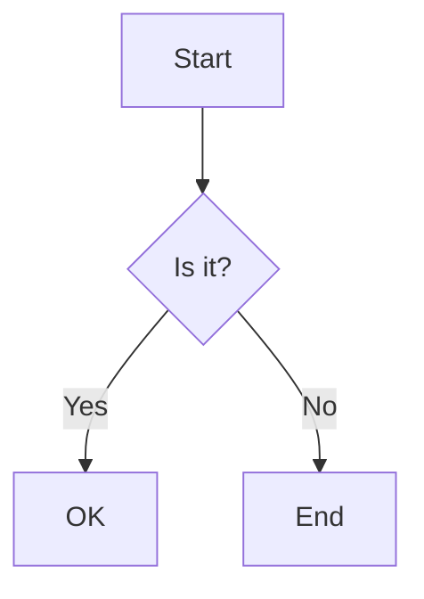

# DocuFlu CLI

> **Sync your Docusaurus documentation to Confluence seamlessly**

[](https://choosealicense.com/licenses/mit/)
[](https://nodejs.org/)
[](https://www.npmjs.com/package/docuflu)

DocuFlu CLI is a command-line tool that automatically syncs your Docusaurus markdown documentation to Confluence pages, maintaining hierarchy, processing internal links, and handling images seamlessly.

## ✨ Features

- 🚀 **One-way sync** from Docusaurus to Confluence
- 📁 **Hierarchy preservation** - maintains your docs folder structure
- 🔗 **Internal link processing** - converts relative links to Confluence URLs
- 🖼️ **Image handling** - uploads and processes images automatically
- 🎨 **Mermaid diagrams** - converts Mermaid code blocks to images
- ⚡ **Incremental sync** - only syncs changed files
- 🎯 **Dry-run mode** - preview changes before applying
- 📊 **Detailed statistics** - track sync progress and results
- 🔄 **State management** - tracks sync history in `.docusaurus/`
- 🛡️ **Auto migration** - seamlessly migrates from legacy state directory

## 🎯 Use Cases

- **Documentation teams** maintaining docs in Docusaurus but need Confluence for company-wide access
- **Open source projects** that want to sync their docs to internal Confluence spaces
- **Technical writers** who prefer Markdown but need to publish to Confluence
- **DevOps teams** automating documentation workflows

## 📋 Prerequisites

- **Node.js** 16.0.0 or higher
- **Docusaurus** project with `docs/` directory
- **Confluence Cloud** instance with API access
- **Confluence API token** ([How to create](https://support.atlassian.com/atlassian-account/docs/manage-api-tokens-for-your-atlassian-account/))

## 🚀 Quick Start

### 1. Installation

```bash
# Clone the repository
git clone https://github.com/your-username/docuflu.git
cd docuflu

# Install dependencies
npm install

# Make CLI globally accessible (optional)
npm link
```

### 2. Configuration

Create a `.env` file in your Docusaurus project root:

```bash
# Copy the example configuration
cp .env.example .env
```

Edit `.env` with your Confluence details:

```env
# Confluence Configuration
CONFLUENCE_BASE_URL=https://your-domain.atlassian.net
CONFLUENCE_USERNAME=your-email@domain.com
CONFLUENCE_API_TOKEN=your-api-token
CONFLUENCE_SPACE_KEY=DOC
CONFLUENCE_ROOT_PAGE_TITLE=Documentation

# Optional Settings
DOCUFLU_EXCLUDE_PATTERNS=*.draft.md,private/**
DOCUFLU_CONCURRENT_UPLOADS=5
DOCUFLU_RETRY_COUNT=3
```

### 3. First Sync

```bash
# Navigate to your Docusaurus project
cd your-docusaurus-project

# Preview what will be synced (dry-run)
node path/to/docuflu/bin/docuflu.js sync --docs --dry-run

# Perform the actual sync
node path/to/docuflu/bin/docuflu.js sync --docs
```

## 📖 Usage

### CLI Commands

#### Sync All Documentation

```bash
# Sync all files in docs/ directory
docuflu sync --docs

# Preview without making changes
docuflu sync --docs --dry-run
```

#### Sync Single File

```bash
# Sync a specific markdown file
docuflu sync --file docs/intro.md

# Preview single file sync
docuflu sync --file docs/intro.md --dry-run
```

#### Sync Blog Posts (Coming Soon)

```bash
# Sync blog posts
docuflu sync --blog
```

#### Get Help

```bash
# Show general help
docuflu --help

# Show sync command help
docuflu sync --help
```

### Command Options

| Option | Description | Example |
|--------|-------------|---------|
| `--docs` | Sync all documentation files | `docuflu sync --docs` |
| `--blog` | Sync blog posts (placeholder) | `docuflu sync --blog` |
| `--file <path>` | Sync specific file | `docuflu sync --file docs/intro.md` |
| `--dry-run` | Preview without changes | `docuflu sync --docs --dry-run` |
| `--help` | Show help information | `docuflu --help` |

## 🔧 Configuration

### Environment Variables

| Variable | Required | Description | Default |
|----------|----------|-------------|---------|
| `CONFLUENCE_BASE_URL` | ✅ | Your Confluence instance URL | - |
| `CONFLUENCE_USERNAME` | ✅ | Your Confluence email | - |
| `CONFLUENCE_API_TOKEN` | ✅ | Your Confluence API token | - |
| `CONFLUENCE_SPACE_KEY` | ✅ | Target Confluence space | - |
| `CONFLUENCE_ROOT_PAGE_TITLE` | ❌ | Parent page for docs | `Documentation` |
| `DOCUFLU_EXCLUDE_PATTERNS` | ❌ | Files to exclude (comma-separated) | - |
| `DOCUFLU_CONCURRENT_UPLOADS` | ❌ | Max concurrent uploads | `5` |
| `DOCUFLU_RETRY_COUNT` | ❌ | Retry attempts for failed requests | `3` |

### State Management

DocuFlu stores sync state in `.docusaurus/sync-state.json` to enable:

- **Incremental sync** - only process changed files
- **Page tracking** - maintain Confluence page IDs
- **Statistics** - track sync history and performance
- **Orphan cleanup** - remove pages for deleted files

```json
{
  "version": "1.0.0",
  "lastSync": "2025-01-27T10:30:00Z",
  "pages": {
    "intro.md": {
      "confluenceId": "123456789",
      "title": "Introduction",
      "lastModified": "2025-01-27T10:25:00Z",
      "parentId": "987654321",
      "spaceKey": "DOC"
    }
  },
  "stats": {
    "totalPages": 25,
    "created": 5,
    "updated": 3,
    "skipped": 17,
    "failed": 0
  }
}
```

## 🔗 Internal Link Processing

DocuFlu automatically converts Docusaurus internal links to Confluence URLs:

### Supported Link Types

| Docusaurus Format | Confluence Result |
|-------------------|-------------------|
| `./sibling.md` | `https://domain.atlassian.net/wiki/spaces/SPACE/pages/ID/Title` |
| `../parent.md` | `https://domain.atlassian.net/wiki/spaces/SPACE/pages/ID/Title` |
| `/docs/absolute-path` | `https://domain.atlassian.net/wiki/spaces/SPACE/pages/ID/Title` |
| `./file.md#section` | `https://domain.atlassian.net/wiki/spaces/SPACE/pages/ID/Title#section` |
| `[text][ref]` + `[ref]: url` | Reference-style links converted |

### Link Conversion Examples

```markdown
<!-- Before (Docusaurus) -->
See the [installation guide](./installation.md) for details.
Check out [advanced concepts](../advanced/concepts.md#overview).

<!-- After (Confluence) -->
See the [installation guide](https://domain.atlassian.net/wiki/spaces/DOC/pages/123456/Installation+Guide) for details.
Check out [advanced concepts](https://domain.atlassian.net/wiki/spaces/DOC/pages/789012/Advanced+Concepts#overview).
```

## 🖼️ Image Handling

DocuFlu processes images automatically:

### Supported Image Types

- **Local images**: `./images/screenshot.png`
- **Static assets**: `/img/logo.png` (from Docusaurus static folder)
- **External URLs**: `https://example.com/image.jpg` (preserved as-is)

### Image Processing Flow

1. **Detection** - Find all images in markdown content
2. **Resolution** - Resolve paths relative to Docusaurus project
3. **Upload** - Upload local images to Confluence as attachments
4. **Conversion** - Update HTML to reference Confluence attachments
5. **Caching** - Avoid duplicate uploads

## 🎨 Mermaid Diagram Support

DocuFlu automatically converts Mermaid diagrams to images:

### Supported Diagram Types

- **Flowcharts**: `graph TD`, `graph LR`
- **Sequence diagrams**: `sequenceDiagram`
- **Class diagrams**: `classDiagram`
- **State diagrams**: `stateDiagram`
- **Entity relationship**: `erDiagram`
- **User journey**: `journey`
- **Gantt charts**: `gantt`

### Mermaid Processing Flow

1. **Detection** - Find Mermaid code blocks in markdown
2. **Auto-install** - Install Mermaid CLI if not available
3. **Generation** - Convert Mermaid code to PNG images
4. **Upload** - Upload generated images to Confluence
5. **Conversion** - Replace code blocks with image attachments
6. **Cleanup** - Remove temporary files

### Example Conversion

```markdown
<!-- Before (Docusaurus) -->


<!-- After (Confluence) -->
[Centered PNG image with diagram visualization]
```

### Mermaid CLI Installation

DocuFlu automatically installs Mermaid CLI when needed:

```bash
# Automatic installation (no action required)
npm install -g @mermaid-js/mermaid-cli

# Manual installation (optional)
npm install -g @mermaid-js/mermaid-cli
```

## 📁 Directory Structure

Your Docusaurus project structure is preserved in Confluence:

```
docs/
├── intro.md                    → Root level page
├── tutorial-basics/            → "Tutorial Basics" parent page
│   ├── create-a-page.md       →   Child page
│   └── deploy-your-site.md    →   Child page
└── advanced/                   → "Advanced" parent page
    └── concepts/               →   "Concepts" parent page
        └── deep-nested.md     →     Child page
```

Results in Confluence hierarchy:

```
📁 Documentation (root)
├── 📄 Introduction
├── 📁 Tutorial Basics
│   ├── 📄 Create a Page
│   └── 📄 Deploy your site
└── 📁 Advanced
    └── 📁 Concepts
        └── 📄 Deep Nested Concepts
```

## 📊 Sync Statistics

After each sync, DocuFlu provides detailed statistics:

```bash
📊 SUMMARY:
Total documents: 25
Processed: 8
Created: 3
Updated: 2
Skipped: 17
Failed: 0

🔗 Internal Links: 45 converted, 12 external preserved
📷 Images: 8 uploaded, 3 cached, 2 external URLs
🎨 Mermaid Diagrams: 5 processed, 0 failed
⏱️ Duration: 1m 23s
```

## 🧪 Testing

Run the test suite to verify functionality:

```bash
# Run all tests
npm test

# Test specific components
node test/test-basic.js              # Basic markdown parsing
node test/test-hierarchy.js          # Hierarchy structure
node test/test-internal-references.js # Link processing
node test/test-migration.js          # State migration

# Test with real Confluence (requires .env)
node test/test-nested-hierarchy.js
```

## 🛠️ Development

### Project Structure

```
docuflu/
├── bin/
│   └── docuflu.js                  # CLI entry point
├── lib/
│   ├── commands/
│   │   └── sync.js                 # Sync command logic
│   └── core/
│       ├── confluence-client.js    # Confluence API wrapper
│       ├── markdown-parser.js      # Markdown processing
│       ├── docusaurus-scanner.js   # Project scanning
│       ├── state-manager.js        # State management
│       ├── reference-processor.js  # Link processing
│       ├── image-processor.js      # Image handling
│       ├── migrate-state.js        # State migration
│       └── config.js               # Configuration
├── test/                           # Test files
├── docusaurus-example/             # Example project
└── README.md                       # This file
```

### Contributing

1. Fork the repository
2. Create a feature branch: `git checkout -b feature/amazing-feature`
3. Make your changes and add tests
4. Run tests: `npm test`
5. Commit changes: `git commit -m 'Add amazing feature'`
6. Push to branch: `git push origin feature/amazing-feature`
7. Open a Pull Request

### Dependencies

- **axios** - HTTP client for Confluence API
- **markdown-it** - Markdown parsing and conversion
- **gray-matter** - Frontmatter parsing
- **commander** - CLI framework
- **chalk** - Colored terminal output
- **ora** - Loading spinners
- **fs-extra** - Enhanced file system operations

## 🚨 Troubleshooting

### Common Issues

#### Authentication Failed
```bash
❌ Confluence connection failed: Unauthorized
```
**Solution**: Check your `CONFLUENCE_USERNAME` and `CONFLUENCE_API_TOKEN` in `.env`

#### Page Not Found
```bash
⚠️ Could not resolve internal reference: ./missing-file.md
```
**Solution**: Ensure the referenced file exists and has been synced to Confluence

#### Image Upload Failed
```bash
⚠️ Failed to upload image.png: Request failed with status code 400
```
**Solution**: Check image file exists and is accessible. Verify Confluence permissions.

#### State Migration
```bash
🔄 Migrating state from .docuflu/ to .docusaurus/...
```
**Info**: This is normal on first run after upgrade. Old state is backed up to `.docuflu.backup/`

### Debug Mode

Enable debug output for troubleshooting:

```bash
DEBUG=1 docuflu sync --docs
```

### Getting Help

- 📖 Check this README for common solutions
- 🐛 [Open an issue](https://github.com/your-username/docuflu/issues) for bugs
- 💡 [Start a discussion](https://github.com/your-username/docuflu/discussions) for questions
- 📧 Contact the maintainers for support

## 📈 Roadmap

### Current Status: Phase 2+ Complete ✅
- ✅ Single file sync
- ✅ Multi-file sync with hierarchy
- ✅ Internal reference processing
- ✅ Image handling
- ✅ Mermaid diagram processing
- ✅ State management
- ✅ Auto migration

### Phase 3: Advanced Features 🔄
- ❌ Blog post synchronization
- ❌ Advanced Docusaurus syntax (admonitions, tabs)
- ❌ Math equation processing (LaTeX)
- ❌ Global npm installation
- ❌ Bi-directional sync
- ❌ Real-time collaboration

### Phase 4: Enterprise Features 🔮
- ❌ Multi-space support
- ❌ CI/CD integration
- ❌ Custom markdown extensions
- ❌ Advanced error recovery
- ❌ Performance optimization

## 📄 License

This project is licensed under the MIT License - see the [LICENSE](LICENSE) file for details.

## 🙏 Acknowledgments

- [Docusaurus](https://docusaurus.io/) - Amazing documentation platform
- [Confluence](https://www.atlassian.com/software/confluence) - Collaboration workspace
- [markdown-it](https://github.com/markdown-it/markdown-it) - Markdown parser
- All contributors and users of this project

## 📞 Support

- **Documentation**: This README and inline code comments
- **Issues**: [GitHub Issues](https://github.com/your-username/docuflu/issues)
- **Discussions**: [GitHub Discussions](https://github.com/your-username/docuflu/discussions)
- **Email**: [maintainer@example.com](mailto:maintainer@example.com)

---

**Made with ❤️ for the documentation community**

*DocuFlu CLI - Bridging the gap between Docusaurus and Confluence*
