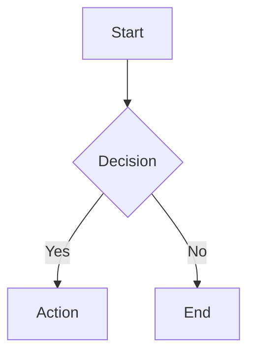
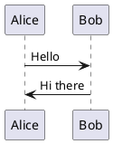
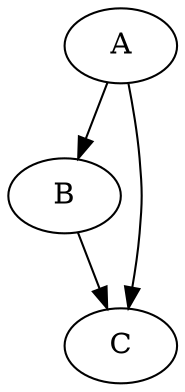

# docflu CLI

> **Sync Docusaurus documentation to Confluence seamlessly**

[](https://choosealicense.com/licenses/mit/)
[](https://nodejs.org/)

docflu CLI automatically syncs your Docusaurus markdown documentation to Confluence pages, maintaining hierarchy, processing internal links, handling images, and converting diagrams to high-quality SVG images.

> **🤖 AI-Powered Development**: Built in 5 hours using [Cursor](https://cursor.sh/) + [Claude 4 Sonnet](https://www.anthropic.com/claude)

## ✨ Features

- **One-way sync** Docusaurus → Confluence
- **Hierarchy preservation** - maintains folder structure
- **Internal link processing** - converts relative links to Confluence URLs
- **Image handling** - uploads and processes images automatically
- **Comprehensive diagram support** - Mermaid, PlantUML, Graphviz/DOT, D2 → SVG
- **Auto CLI installation** - automatically installs required diagram tools
- **High-quality output** - 1600x1200 SVG resolution with professional formatting
- **Incremental sync** - only syncs changed files
- **Dry-run mode** - preview changes before applying
- **State management** - tracks sync history in `.docusaurus/`

## 🚀 Quick Start

### Installation

```bash
# Install from source
git clone https://github.com/tuanpmt/docflu.git
cd docflu && npm install && npm link

# Verify installation
docflu --version
```

### Setup

```bash
# Navigate to your Docusaurus project
cd your-docusaurus-project

# Initialize configuration
docflu init

# Edit .env with your Confluence credentials
```

### First Sync

```bash
# Preview changes
docflu sync --docs --dry-run

# Sync all documentation
docflu sync --docs
```

## 📖 Usage

### Commands

| Command | Description |
|---------|-------------|
| `docflu init` | Setup .env configuration |
| `docflu sync --docs` | Sync all documentation |
| `docflu sync --file <path>` | Sync specific file |
| `docflu sync --dry-run` | Preview without changes |

### Configuration (.env)

```env
CONFLUENCE_BASE_URL=https://your-domain.atlassian.net
CONFLUENCE_USERNAME=your-email@domain.com
CONFLUENCE_API_TOKEN=your-api-token
CONFLUENCE_SPACE_KEY=DOC
CONFLUENCE_ROOT_PAGE_TITLE=Documentation
```

## 🔧 Key Features

### Hierarchy Preservation
```
docs/
├── intro.md                    → Introduction
├── tutorial-basics/            → Tutorial Basics (parent)
│   ├── create-a-page.md       →   Create a Page
│   └── deploy-your-site.md    →   Deploy your site
└── advanced/                   → Advanced (parent)
    └── concepts/               →   Concepts (parent)
        └── deep-nested.md     →     Deep Nested Concepts
```

### Internal Link Processing
Converts Docusaurus links to Confluence URLs:
- `./sibling.md` → `https://domain.atlassian.net/wiki/spaces/SPACE/pages/ID/Title`
- `../parent.md` → Confluence URL with proper hierarchy
- `/docs/absolute-path` → Resolved absolute paths
- `./file.md#section` → Anchor links preserved

### Comprehensive Diagram Support
Automatically converts diagrams to high-quality SVG images:

**Mermaid** (flowcharts, sequence, class, state, ER, journey, gantt)


**PlantUML** (UML diagrams, architecture, sequence)


**Graphviz/DOT** (directed graphs, network diagrams)


**D2** (modern declarative diagrams)
```d2
server -> database: query
database -> server: result
```

### Image & Diagram Features
- **Local images**: Uploaded as Confluence attachments
- **Diagram conversion**: Code blocks → SVG images (1600x1200)
- **Professional formatting**: Center-aligned with enhanced styling
- **Bidirectional sync**: Original code preserved in metadata
- **Auto-installation**: CLI tools installed automatically
- **Error handling**: Graceful fallback to code blocks if processing fails
- **External URLs**: Preserved as-is

### State Management
Tracks sync status in `.docusaurus/sync-state.json`:
- Incremental sync (only changed files)
- Page ID tracking
- Statistics and history

## 🧪 Testing

```bash
# Run all tests
npm test

# Test specific components
node test/test-basic.js
node test/test-hierarchy.js
node test/test-internal-references.js

# Test diagram processing
node test/test-diagram-comprehensive.js    # All 4 diagram types
node test/test-diagram-real.js            # Real conversion test
node test/test-mermaid.js                 # Mermaid specific
```

## 🛠️ Development

> **📋 IMPORTANT**: Always read `CONTEXT.md` before editing with Cursor for complete project understanding.

### Project Structure
```
docflu/
├── bin/docflu.js              # CLI entry point
├── lib/
│   ├── commands/sync.js        # Sync logic
│   └── core/                   # Core modules
│       ├── confluence-client.js
│       ├── markdown-parser.js
│       ├── docusaurus-scanner.js
│       └── state-manager.js
└── test/                       # Test files
```

### Contributing
1. Fork repository
2. **Read CONTEXT.md first**
3. Create feature branch
4. Add tests
5. Update documentation
6. Submit PR

## 🚨 Troubleshooting

### Common Issues

**Authentication Failed**
```bash
❌ Confluence connection failed: Unauthorized
```
Solution: Check `CONFLUENCE_USERNAME` and `CONFLUENCE_API_TOKEN` in `.env`

**Package Not Found**
```bash
❌ npm ERR! 404 Not Found
```
Solution: Install from source (npm package not published yet)

**Debug Mode**
```bash
DEBUG=1 docflu sync --docs
```

## 📈 Status

### ✅ Completed (23/23 features)
- Single & multi-file sync
- Hierarchy support
- Internal reference processing
- Image & comprehensive diagram handling (4 types)
- State management & migration
- CLI commands & configuration

### 🔄 Planned
- Blog post sync
- Advanced Docusaurus syntax
- Global npm installation
- Status command
- Bidirectional sync

## 📄 License

MIT License - see [LICENSE](LICENSE) file.

## 🙏 Acknowledgments

**AI-Powered Development**:
- [Cursor](https://cursor.sh/) - AI code editor
- [Claude 4 Sonnet](https://www.anthropic.com/claude) - AI assistant

**Technologies**:
- [Docusaurus](https://docusaurus.io/) - Documentation platform
- [Confluence](https://www.atlassian.com/software/confluence) - Collaboration workspace
- [Node.js](https://nodejs.org/) + [Commander.js](https://github.com/tj/commander.js/)

---

**Made with ❤️ for the documentation community**

*Powered by AI* 🤖✨
