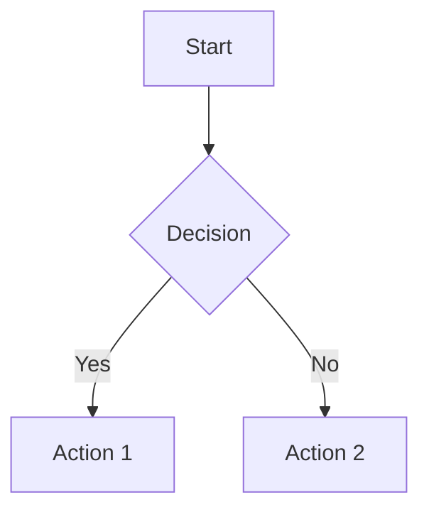

# Google Docs Image Processing Implementation

> Comprehensive image and diagram processing solution for Google Docs sync feature

## 📋 Overview

This document describes the complete implementation of image and diagram processing for the Google Docs sync feature in docflu CLI. The solution enables automatic conversion and upload of images, Mermaid diagrams, and other visual content from Docusaurus markdown files to Google Docs.

## 🏗️ Architecture

### Core Components

```
lib/core/gdocs/
├── gdocs-image-processor.js     # Main image processing orchestrator
├── diagram-processor.js         # Google Docs specific diagram processor
├── image-processor.js           # Google Docs specific image processor
├── google-drive-client.js       # Google Drive API integration
├── google-docs-client.js        # Google Docs API with enhanced scopes
├── google-docs-sync.js          # Main sync engine with image support
└── google-docs-state.js         # State management for caching
```

### Custom Google Docs Implementation

- **Diagram Processor**: Custom `diagram-processor.js` specifically designed for Google Drive integration
- **Image Processor**: Dedicated `image-processor.js` for Google Drive upload and path resolution
- **State Management**: Extends Google Docs state for image caching
- **OAuth2 System**: Enhanced with Google Drive API permissions

## 🔧 Implementation Details

### 1. Google Drive API Integration

#### OAuth2 Scope Enhancement

Updated scopes in `google-docs-client.js`:
```javascript
this.scopes = [
  'https://www.googleapis.com/auth/documents',    // Google Docs access
  'https://www.googleapis.com/auth/drive.file'    // Google Drive file access
];
```

#### Google Drive Client (`google-drive-client.js`)

**Key Features:**
- **Image Folder Management**: Creates and manages dedicated `docflu-images-{timestamp}` folder
- **SHA256 Caching**: Prevents duplicate uploads using content hashing
- **State Persistence**: Tracks uploaded images across sync sessions
- **Public Permissions**: Automatically sets public access for Google Docs integration
- **Remote Image Support**: Downloads and re-uploads external images
- **HTML Image Support**: Processes HTML `` tags as native images

**Core Methods:**
```javascript
// Initialize with OAuth2 credentials
await driveClient.initialize(oauth2Client, stateManager);

// Upload local image with caching
const result = await driveClient.uploadImage('/path/to/image.png');
// Returns: { url, fileId, fileName, size, cached: false }

// Upload remote image
const result = await driveClient.uploadRemoteImage('https://example.com/image.png');
```

### 2. Image Processing Pipeline

#### Main Processor (`gdocs-image-processor.js`)

**Processing Workflow:**
1. **All Diagrams**: Process Mermaid, PlantUML, Graphviz, D2 using custom Google Docs diagram processor
2. **Regular Images**: Handle local and remote images using dedicated Google Docs image processor
3. **HTML Images**: Process HTML `` tags with full attribute extraction (src, alt, title)
4. **Path Resolution**: Support Docusaurus static paths (`/img/...`)
5. **Google Drive Upload**: All images and diagrams uploaded to Google Drive with caching

**Image Format Support:**
- **Markdown Images**: `` format
- **HTML Images**: `` tags
- **Mixed Content**: Both formats in same document
- **Attribute Extraction**: Full alt and title attribute support
- **Style Preservation**: HTML styling attributes maintained during processing

**Key Features:**
```javascript
const processor = new GDocsImageProcessor(projectRoot);
await processor.initialize(driveClient, stateManager);

// Process all images in markdown
const result = await processor.processImages(markdown, filePath);
// Returns: { processedMarkdown, imageRequests, stats }
```

#### Google Docs Diagram Processor (`diagram-processor.js`)

**Comprehensive Diagram Support:**
- **Mermaid**: Enhanced PNG generation optimized for Google Docs
- **PlantUML**: Java-based diagram generation with PNG output
- **Graphviz**: DOT language diagram processing with PNG format
- **D2**: Modern diagram language support with PNG output

**Key Features:**
- Custom Google Drive upload integration
- PNG format for maximum Google Docs compatibility
- Automatic SVG to PNG conversion using Sharp (Node.js)
- High-quality rendering with proper backgrounds
- Automatic CLI installation if missing
- Comprehensive error handling and cleanup

**Mermaid Configuration:**
```javascript
const mermaidConfig = {
  theme: "default",
  securityLevel: "strict",
  themeVariables: {
    primaryColor: "#ffffff",
    primaryTextColor: "#000000",
    background: "#ffffff",
    fontFamily: "Arial, Helvetica, sans-serif"
  }
};
```

**Processing Method:**
```javascript
// Process all diagram types in one call
const result = await diagramProcessor.processAllDiagrams(markdownContent);
// Returns: { processedMarkdown, diagramMap, stats }
```

### 3. SVG to PNG Conversion

#### Automatic Format Conversion

**Why Convert SVG?**
Google Docs API doesn't natively support SVG format. SVG images may not display properly or at all in Google Docs. The image processor automatically converts SVG files to PNG format for maximum compatibility.

**Sharp Integration (Node.js):**
```javascript
async convertImageForGoogleDocs(imagePath) {
  const ext = path.extname(imagePath).toLowerCase();
  
  if (ext !== '.svg') {
    return imagePath; // No conversion needed
  }
  
  // Try to load sharp for SVG conversion
  let sharp;
  try {
    sharp = require('sharp');
  } catch (error) {
    console.warn('Sharp package not available, uploading SVG as-is');
    return imagePath;
  }
  
  // Convert SVG to PNG with high quality
  const pngPath = path.join(tempDir, `${baseName}.png`);
  await sharp(imagePath)
    .png({ quality: 90, compressionLevel: 6 })
    .resize(1200, 1200, {
      fit: 'inside',
      withoutEnlargement: true,
      background: { r: 255, g: 255, b: 255, alpha: 1 }
    })
    .toFile(pngPath);
  
  return pngPath;
}
```

**Conversion Features:**
- **High Quality**: PNG with 90% quality and smart compression
- **Smart Resizing**: Max 1200x1200 with aspect ratio preservation
- **White Background**: Ensures proper display in Google Docs
- **Fallback Support**: Gracefully handles missing Sharp package
- **Automatic Detection**: Processes only SVG files
- **Pure Node.js**: No external dependencies or system tools required

**Package Installation:**
Sharp is included as an optional dependency. If not available, SVG files will be uploaded as-is with a warning.

### 4. Unique Placeholder System

#### Placeholder Generation Strategy

**Problem Solved:**
Previous implementation created duplicate placeholders when processing both diagrams and images, causing incorrect image placement in Google Docs.

**Solution - Unique Placeholder Types:**
- `[DIAGRAM_PLACEHOLDER0]`, `[DIAGRAM_PLACEHOLDER1]` for Mermaid diagrams
- `[IMAGE_PLACEHOLDER0]`, `[IMAGE_PLACEHOLDER1]` for regular images

**Implementation:**
```javascript
// Diagram processing
for (const [originalContent, replacement] of diagramResult.diagramMap) {
  const placeholder = `[DIAGRAM_PLACEHOLDER${imageRequests.length}]`;
  
  processedMarkdown = processedMarkdown.replace(
    ``,
    placeholder
  );
  
  imageRequests.push({
    type: 'diagram',
    url: replacement.url,
    altText: replacement.alt,
    placeholder: placeholder
  });
}

// Image processing  
if (url.includes('drive.google.com') || url.includes('googleusercontent.com')) {
  const placeholder = `[IMAGE_PLACEHOLDER${imageRequests.length}]`;
  
  processedMarkdown = processedMarkdown.replace(fullMatch, placeholder);
  
  imageRequests.push({
    type: 'image',
    url: url,
    altText: alt || 'Image',
    placeholder: placeholder
  });
}
```

**Converter Integration:**
```javascript
// Updated converter to handle both placeholder types
if (trimmedLine.match(/^\[(DIAGRAM_PLACEHOLDER|IMAGE_PLACEHOLDER)\d+\]$/)) {
  const placeholderText = trimmedLine + '\n';
  
  requests.push({
    insertText: {
      text: placeholderText,
      endOfSegmentLocation: { segmentId: '' }
    }
  });
  
  debugInfo.processing.elements.push({
    lineNumber: i + 1,
    type: 'image_placeholder',
    content: trimmedLine,
    converted: true,
    reason: 'Converted to text for native image replacement'
  });
}
```

#### Native Image Insertion

**Index-Aware Replacement:**
```javascript
async createImageInsertionRequests(imageRequests, document) {
  // Find all placeholder positions first
  const placeholderPositions = [];
  
  for (let i = 0; i < imageRequests.length; i++) {
    const placeholder = imageRequests[i].placeholder;
    const position = this.findTextInDocument(placeholder, textElements);
    
    if (position) {
      placeholderPositions.push({
        imageRequest: imageRequests[i],
        placeholder,
        position,
        originalIndex: i
      });
    }
  }
  
  // Sort by position (highest index first) to avoid index shifts
  placeholderPositions.sort((a, b) => b.position.startIndex - a.position.startIndex);
  
  // Process placeholders from highest to lowest index
  for (const item of placeholderPositions) {
    const { imageRequest, position } = item;
    
    // Delete placeholder text first
    requests.push({
      deleteContentRange: {
        range: {
          startIndex: position.startIndex,
          endIndex: position.endIndex
        }
      }
    });
    
    // Insert native image at the same position
    requests.push({
      insertInlineImage: {
        uri: imageRequest.url,
        location: {
          index: position.startIndex
        }
      }
    });
  }
  
  return requests;
}
```

### 5. Path Resolution System

#### Docusaurus Integration

**Static Path Support:**
- Automatically detects Docusaurus project root
- Converts `/img/diagram.png` → `{projectRoot}/static/img/diagram.png`
- Supports both relative and absolute paths

**Path Resolution Logic:**
```javascript
// Handles multiple path formats
resolveImagePath(src, filePath) {
  if (src.startsWith('/')) {
    // Docusaurus absolute path
    const docusaurusRoot = this.findDocusaurusRoot(filePath);
         return path.join(docusaurusRoot, 'static', src.substring(1));
  }
  
  // Relative path
  return path.resolve(path.dirname(filePath), src);
}
```

### 6. State Management & Caching

#### Image Cache Strategy

**SHA256-based Caching:**
```javascript
// Generate content hash
const imageHash = crypto.createHash('sha256')
  .update(fs.readFileSync(imagePath))
  .digest('hex');

// Check cache before upload
const cachedImage = state.googleDrive?.uploadedImages?.[imageHash];
```

**State Structure:**
```json
{
  "googleDrive": {
    "imageFolderId": "1abc123def456",
    "uploadedImages": {
      "sha256hash": {
        "url": "https://drive.google.com/uc?id=...",
        "fileId": "1def456ghi789",
        "fileName": "image-hash.png",
        "size": 15360,
        "uploadedAt": "2024-01-27T10:30:45.123Z"
      }
    }
  }
}
```

### 7. Google Docs Integration

#### Document Insertion

**Image Request Generation:**
```javascript
// Create Google Docs API requests
createImageInsertionRequests(imageRequests) {
  return imageRequests.map(imageRequest => ({
    insertInlineImage: {
      uri: imageRequest.url,
      endOfSegmentLocation: { segmentId: '' }
    }
  }));
}
```

#### Markdown Processing

**Content Replacement:**
```javascript
// Replace markdown images with Google Drive URLs
processedMarkdown = processedMarkdown.replace(
  originalImageMarkdown,
  ``
);
```

## 🔄 Workflow Integration

### Sync Process Enhancement

1. **Pre-processing**: Images processed before markdown conversion
2. **Upload Phase**: Images uploaded to Google Drive with caching
3. **Markdown Update**: URLs replaced with Google Drive links
4. **Document Sync**: Enhanced markdown converted to Google Docs
5. **State Persistence**: Cache updated for future syncs

### Error Handling & Permissions

#### Automatic Token Refresh

**Permission Error Detection:**
```javascript
isPermissionError(error) {
  const permissionErrors = [
    'Insufficient Permission',
    'insufficient_scope',
    'invalid_grant',
    'Token has been expired or revoked'
  ];
  
  return permissionErrors.some(permError => 
    error.message.toLowerCase().includes(permError.toLowerCase())
  );
}
```

**Automatic Recovery:**
```javascript
// Detect permission errors and re-authenticate
if (this.client.isPermissionError(error)) {
  console.log('⚠️ Permission error detected. Re-authenticating...');
  await this.client.clearTokens();
  await this.client.authenticate();
  // Retry operation
}
```

## 📊 Performance Optimizations

### Caching Strategy

- **Content-based Hashing**: SHA256 prevents duplicate uploads
- **Session Caching**: In-memory cache for single sync session
- **State Persistence**: Long-term cache across multiple syncs
- **Drive File Verification**: Validates existing files before reuse

### Upload Efficiency

- **Parallel Processing**: Multiple images uploaded simultaneously
- **Smart Retry**: Automatic retry with exponential backoff
- **Format Optimization**: PNG format for diagram compatibility
- **Format Detection**: Automatic MIME type detection

## 🐛 Debug and Troubleshooting

### Enable Debug Mode

To enable detailed debug logging for image processing:

```bash
export DEBUG_GDOCS_CONVERTER=true
# or
DEBUG_GDOCS_CONVERTER=true docflu sync --gdocs
```

### Debug Output Location

Debug files are saved to:
```
.docusaurus/debug/gdocs-image-processor/
├── image-processing-debug-2024-01-27T10-30-45-123Z.json    # Detailed debug info
├── image-summary-2024-01-27T10-30-45-123Z.json             # Quick summary
├── image-processing-debug-error-2024-01-27.json            # Error cases
└── ...
```

### Debug File Structure

#### Main Debug File (`image-processing-debug-*.json`)

```json
{
  "timestamp": "2024-01-27T10:30:45.123Z",
  "input": {
    "markdown": "# Document\n\n```mermaid\ngraph TD\n  A --> B\n```\n\n",
    "filePath": "docs/intro.md"
  },
  "processing": {
    "phases": [
      {
        "phase": "initialization",
        "timestamp": "2024-01-27T10:30:45.123Z",
        "inputLength": 85,
        "filePath": "docs/intro.md"
      },
      {
        "phase": "mermaid_processing_start",
        "timestamp": "2024-01-27T10:30:45.124Z"
      },
      {
        "phase": "mermaid_processing_complete",
        "timestamp": "2024-01-27T10:30:45.567Z",
        "diagramsProcessed": 1
      }
    ],
    "images": [
      {
        "alt": "Local Image",
        "src": "./image.png",
        "type": "markdown",
        "isRemote": false
      }
    ],
    "diagrams": [
      {
        "type": "mermaid",
        "count": 1,
        "matches": [
          {
            "content": "graph TD\n  A --> B...",
            "index": 15
          }
        ]
      }
    ],
    "uploads": [
      {
        "type": "mermaid",
        "fileName": "mermaid-a1b2c3d4.svg",
        "url": "https://drive.google.com/uc?id=1abc123",
        "size": 2048,
        "cached": false,
        "timestamp": "2024-01-27T10:30:45.500Z"
      },
      {
        "type": "image",
        "fileName": "sha256hash-image.png",
        "url": "https://drive.google.com/uc?id=2def456",
        "size": 15360,
        "cached": true,
        "timestamp": "2024-01-27T10:30:45.600Z"
      }
    ]
  },
  "output": {
    "processedMarkdownLength": 120,
    "imageRequestsCount": 2,
    "stats": {
      "imagesFound": 1,
      "imagesProcessed": 1,
      "imagesCached": 1,
      "diagramsProcessed": 1,
      "errors": []
    },
    "summary": {
      "totalImages": 1,
      "totalProcessed": 2,
      "successRate": 100
    }
  },
  "errors": [],
  "metadata": {
    "processorVersion": "1.0.0",
    "nodeVersion": "v18.17.0",
    "debugEnabled": true,
    "debugDir": ".docusaurus/debug/gdocs-image-processor",
    "filename": "image-processing-debug-2024-01-27T10-30-45-123Z.json",
    "projectRoot": "/path/to/project"
  }
}
```

#### Summary File (`image-summary-*.json`)

```json
{
  "timestamp": "2024-01-27T10:30:45.123Z",
  "inputLength": 85,
  "filePath": "docs/intro.md",
  "phases": 6,
  "imagesFound": 1,
  "diagramsFound": 1,
  "uploadsCompleted": 2,
  "outputStats": {
    "imagesFound": 1,
    "imagesProcessed": 1,
    "imagesCached": 1,
    "diagramsProcessed": 1,
    "errors": []
  },
  "errors": 0,
  "filename": "image-processing-debug-2024-01-27T10-30-45-123Z.json"
}
```

### Common Debug Scenarios

#### 1. **Mermaid Diagram Processing Issues**

**Problem**: Mermaid diagrams not rendering or failing to upload

**Debug Steps**:
1. Check `diagrams` array for detected Mermaid blocks
2. Look for `mermaid_processing_start/complete` phases
3. Verify uploads array for Mermaid entries
4. Check errors array for Mermaid-specific errors

**Example Error**:
```json
{
  "type": "mermaid",
  "message": "Mermaid CLI not found",
  "content": "graph TD\n  A --> B...",
  "timestamp": "2024-01-27T10:30:45.300Z"
}
```

#### 2. **Permission Issues**

**Problem**: Google Drive API permission errors

**Solution**: Automatic token refresh implemented
```javascript
// Automatic detection and recovery
if (this.client.isPermissionError(error)) {
  await this.client.clearTokens();
  await this.client.authenticate(); // Request new permissions
}
```

#### 3. **Placeholder Duplication Issues**

**Problem**: Images appearing in wrong locations or placeholders visible in document

**Debug Steps**:
1. Check debug file for placeholder types: `[DIAGRAM_PLACEHOLDER...]` vs `[IMAGE_PLACEHOLDER...]`
2. Verify unique placeholder generation in processing phases
3. Look for duplicate placeholder names in document text
4. Check `createImageInsertionRequests` for proper index sorting

**Example Debug Output**:
```json
{
  "processing": {
    "phases": [
      {
        "phase": "diagram_processing_complete",
        "diagramsProcessed": 2,
        "placeholders": ["[DIAGRAM_PLACEHOLDER0]", "[DIAGRAM_PLACEHOLDER1]"]
      },
      {
        "phase": "image_processing_complete", 
        "imagesProcessed": 2,
        "placeholders": ["[IMAGE_PLACEHOLDER0]", "[IMAGE_PLACEHOLDER1]"]
      }
    ]
  }
}
```

#### 4. **Path Resolution Issues**

**Problem**: Local images not found

**Debug Steps**:
1. Check `images` array for detected image paths
2. Verify `isRemote` flag is correct
3. Check absolute path resolution in processor
4. Validate Docusaurus static folder detection

## 🚀 Usage Examples

### Basic Image Processing

```bash
# Sync file with images and diagrams
DEBUG_GDOCS_CONVERTER=true docflu sync --file docs/intro.md --gdocs
```

### Supported Content Types

#### Mermaid Diagrams
```markdown

```

#### Local Images
```markdown

  <!-- Docusaurus absolute path -->
```

#### HTML Images
```html


```

#### Remote Images
```markdown

```

## 🔮 Future Enhancements

### Recent Improvements (Phase 2 Complete)

1. **✅ Unique Placeholder System**
   - Resolved duplicate placeholder conflicts
   - Separate naming for diagrams vs images
   - Index-aware replacement algorithm
   - Perfect image positioning in Google Docs

2. **✅ Native Image Insertion**
   - Direct Google Docs API image insertion
   - Placeholder-to-image replacement
   - Index shift handling for multiple images
   - High-fidelity image rendering

3. **✅ HTML Image Support**
   - Full HTML `` tag processing
   - Attribute extraction (src, alt, title)
   - Mixed markdown and HTML image support
   - Automatic conversion to native Google Docs images

4. **✅ Enhanced Debug System**
   - Comprehensive placeholder tracking
   - Phase-based processing logs
   - Error detection and recovery
   - Debug file generation with full context

### Planned Features (Phase 3)

1. **Diagram Enhancements**
   - Advanced PlantUML features
   - Graphviz layout optimization
   - D2 theme customization
   - Custom diagram templates

2. **Image Optimization**
   - Automatic image compression
   - Format conversion (WebP support)
   - Responsive image handling
   - Smart resizing for Google Docs

3. **Advanced Caching**
   - Cross-project image sharing
   - CDN integration
   - Batch upload optimization
   - Smart cache invalidation

4. **Enhanced Error Recovery**
   - Retry mechanisms with exponential backoff
   - Fallback strategies for diagram generation
   - Progressive enhancement for unsupported formats
   - Graceful degradation for missing dependencies

## 📚 Technical References

### Dependencies

- `@mermaid-js/mermaid-cli`: Mermaid diagram generation
- `googleapis`: Google APIs integration
- `fs-extra`: Enhanced file operations
- `crypto`: SHA256 hashing for caching
- `axios`: HTTP requests for remote images
- `mime-types`: MIME type detection for images
- `chalk`: Colored console output

### API Documentation

- [Google Docs API](https://developers.google.com/docs/api)
- [Google Drive API](https://developers.google.com/drive/api)
- [Mermaid CLI](https://github.com/mermaid-js/mermaid-cli)

### Configuration Files

- `.env`: OAuth2 credentials and configuration
- `.docusaurus/google-docs-state.json`: Sync state and image cache
- `.docusaurus/google-tokens.json`: OAuth2 tokens 