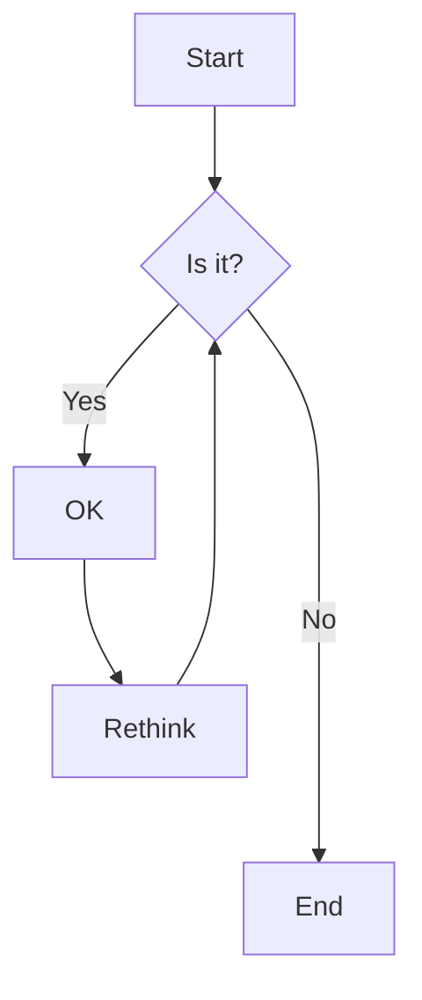

# Advanced Docusaurus Features Test

This document tests advanced Docusaurus features that need special handling.

## Admonitions

:::note
This is a note admonition. It should be converted to Confluence info macro.
:::

:::tip Pro Tip
This is a tip admonition with custom title. Should become a tip macro.
:::

:::info
This is an info admonition. Contains **bold text** and [internal link](./intro.md).
:::

:::caution
This is a caution admonition. Be careful with this content!
:::

:::danger Take care
This is a danger admonition with custom title. Very important warning!
:::

:::warning
This is a warning admonition. Please pay attention.
:::

## Code Blocks with Advanced Features

### Language-specific Code Blocks

```javascript title="docusaurus.config.js"
module.exports = {
  title: 'My Site',
  tagline: 'The tagline of my site',
  url: 'https://your-docusaurus-test-site.com',
  // highlight-next-line
  baseUrl: '/',
  onBrokenLinks: 'throw',
  // highlight-start
  onBrokenMarkdownLinks: 'warn',
  favicon: 'img/favicon.ico',
  // highlight-end
};
```

### Code with Line Numbers

```python showLineNumbers
def fibonacci(n):
    """Calculate fibonacci number"""
    if n <= 1:
        return n
    return fibonacci(n-1) + fibonacci(n-2)

# Example usage
result = fibonacci(10)
print(f"Fibonacci(10) = {result}")
```

### Bash Commands

```bash
# Install dependencies
npm install

# Start development server
npm start

# Build for production
npm run build
```

## Tabs

import Tabs from '@theme/Tabs';
import TabItem from '@theme/TabItem';

<Tabs>
  <TabItem value="npm" label="npm" default>

```bash
npm install docuflu
```

  </TabItem>
  <TabItem value="yarn" label="Yarn">

```bash
yarn add docuflu
```

  </TabItem>
  <TabItem value="pnpm" label="pnpm">

```bash
pnpm add docuflu
```

  </TabItem>
</Tabs>

## Details/Summary (Collapsible)

<details>
  <summary>Click to expand installation details</summary>
  
  ### System Requirements
  - Node.js 16+
  - npm 7+
  - Git

  ### Installation Steps
  1. Clone the repository
  2. Install dependencies
  3. Configure environment
  4. Start the application

</details>

## MDX Components

### Custom Components

import CodeBlock from '@theme/CodeBlock';

<CodeBlock language="jsx" title="React Component">
{`function Welcome(props) {
  return <h1>Hello, {props.name}</h1>;
}`}
</CodeBlock>

## Math Equations

Inline math: $E = mc^2$

Block math:
$$
\int_{-\infty}^{\infty} e^{-x^2} dx = \sqrt{\pi}
$$

## Mermaid Diagrams



## Docusaurus-specific Links

### Doc Links
- [Getting Started](./intro.md)
- [Tutorial Basics](./tutorial-basics/create-a-page.md)
- [Advanced Topics](./advanced/concepts/deep-nested.md)

### Asset Links
- [Static Image](/img/docusaurus.png)
- [Tutorial Image](./tutorial-extras/img/docsVersionDropdown.png)

### Cross-references
See [Create a Page](./tutorial-basics/create-a-page.md#step-by-step) for step-by-step instructions.

Check out the [deployment guide](./tutorial-basics/deploy-your-site.md) when you're ready to publish.

## Tables

| Feature | Supported | Notes |
|---------|-----------|--------|
| Basic Markdown | ✅ | Fully supported |
| Admonitions | 🔄 | Needs conversion |
| Tabs | 🔄 | Needs conversion |
| Mermaid | ❌ | Not yet supported |
| Math | ❌ | Not yet supported |

## Footnotes

This is a text with footnote[^1].

Another footnote reference[^2].

[^1]: This is the first footnote.
[^2]: This is the second footnote with [link](./intro.md).

## Custom HTML

<div className="custom-wrapper">
  <p>This is custom HTML that should be preserved.</p>
  <a href="./intro.md">Internal link in HTML</a>
</div>

## Conclusion

This document covers most advanced Docusaurus features that need special handling during conversion to Confluence. 