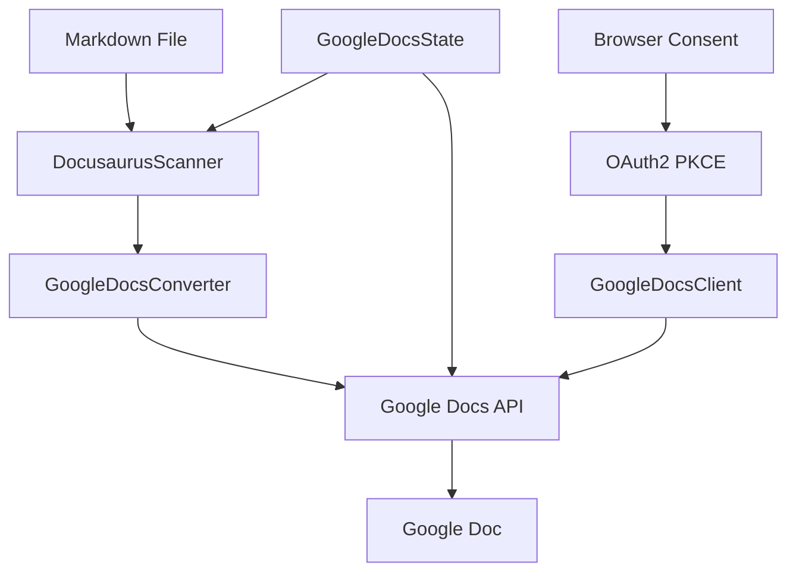

# Google Docs Integration

> Convert and sync Docusaurus markdown content to Google Docs.

## 🗂️ Directory Structure

```
gdocs/
├── google-docs-client.js     # Google OAuth2 & API client
├── google-docs-converter.js  # Markdown → Google Docs converter
├── google-docs-state.js      # State management
├── google-docs-sync.js       # Main sync orchestrator
├── google-drive-client.js    # Google Drive API for image storage
├── gdocs-image-processor.js  # Image processing orchestrator
├── diagram-processor.js      # Google Docs diagram processor
├── image-processor.js        # Google Docs image processor
├── table-converter.js        # Table conversion logic
├── link-processor.js         # Link and attachment processing
├── attachment-processor.js   # File attachment processing
├── README.md                 # This documentation
└── DEBUG.md                  # Debug guide
```

## 📄 File Details

### 1. google-docs-client.js

**Purpose**: Handle OAuth2 PKCE authentication and Google Docs API communication

```javascript
const client = new GoogleDocsClient();
await client.initialize(); // OAuth2 PKCE authentication
const doc = await client.createDocument("My Doc"); // Create new document
await client.testConnection(); // Test API connectivity
```

**Key Features**:
- OAuth2 PKCE authentication flow with browser consent
- Token management (storage, refresh, validation)
- Create and retrieve Google Docs documents
- API connection testing
- Automatic browser opening for consent
- Localhost callback server (port 8080)

**Configuration**:
- Tokens: `.docusaurus/google-tokens.json`
- Client credentials: `.env` (GOOGLE_CLIENT_ID, GOOGLE_CLIENT_SECRET)
- Redirect URI: `http://127.0.0.1:8080/callback`
- Scopes: `https://www.googleapis.com/auth/documents`

**Main Methods**:
- `initialize()` - Setup OAuth2 and authenticate
- `authenticate()` - Run PKCE flow with browser
- `createDocument(title)` - Create new Google Doc
- `getDocument(documentId)` - Retrieve document data
- `testConnection()` - Verify API access

### 2. google-docs-converter.js

**Purpose**: Convert markdown content to Google Docs API requests

```javascript
const converter = new GoogleDocsConverter();
const requests = converter.convertFromMarkdown(markdownContent);
// requests = [{ insertText }, { updateTextStyle }, ...]
```

**Element Processing**:
- **Headings**: `# H1` → Font size 20pt, bold (sizes: H1=20pt, H2=18pt, H3=16pt, H4=14pt, H5=12pt, H6=11pt)
- **Text Format**: 
  + `**bold**` → Bold text
  + `*italic*` → Italic text
  + `` `code` `` → Monospace with gray background
- **Lists**:
  + Ordered: `1. Item` → Numbered list
  + Unordered: `- Item` → Bullet list
- **Code Blocks**: ` ```language ... ``` ` → Formatted code with language label
- **Links**: `[text](url)` → Text only (Google Docs links need special handling)

**Operation Flow**:
1. Parse markdown line by line
2. Identify element type (heading, list, code block, paragraph)
3. Generate Google Docs API requests with proper formatting
4. Manage text indices for batch operations
5. Process inline formatting (bold, italic, code)

**Key Methods**:
- `convertFromMarkdown(markdown)` - Main conversion method
- `createHeading(line, startIndex)` - Generate heading requests
- `createParagraph(text, startIndex)` - Generate paragraph requests
- `createCodeBlock(content, language, startIndex)` - Generate code block requests
- `createList(items, ordered, startIndex)` - Generate list requests
- `processInlineFormatting(text)` - Handle bold, italic, code formatting

### 7. google-docs-state.js

**Purpose**: Manage sync state and document tracking

```javascript
const state = new GoogleDocsState();
await state.init();
if (await state.needsSync('file.md')) {
  // Sync file...
}
await state.updateDocument('docs/intro.md', { documentId: 'abc123', title: 'Intro' });
```

**State Storage Format**:
```json
{
  "lastSync": "2024-01-27T10:00:00Z",
  "rootDocumentId": "abc123",
  "rootDocumentUrl": "https://docs.google.com/document/d/abc123",
  "rootDocumentTitle": "Documentation",
  "documents": {
    "docs/intro.md": {
      "filePath": "docs/intro.md",
      "documentId": "xyz789",
      "title": "Introduction",
      "tabId": null,
      "parentTabId": null,
      "lastModified": "2024-01-27T09:00:00Z",
      "lastSync": "2024-01-27T10:00:00Z"
    }
  },
  "tabs": {},
  "stats": {
    "totalProcessed": 10,
    "created": 5,
    "updated": 3,
    "skipped": 2,
    "failed": 0
  }
}
```

**Key Features**:
- Track file modification times for incremental sync
- Map file paths to Google Doc metadata
- Store root document information
- Sync statistics tracking
- Tab management (for future hierarchy support)
- Compatibility with existing ReferenceProcessor

**Main Methods**:
- `init()` - Initialize state from file
- `needsSync(filePath)` - Check if file needs sync based on modification time
- `updateDocument(filePath, documentData)` - Update document state
- `setRootDocument(documentId, documentUrl, title)` - Set root document info
- `getDocument(filePath)` - Get document by file path
- `updateStats(operation)` - Update sync statistics
- `save()` - Save state to `.docusaurus/google-docs-state.json`

### 8. google-docs-sync.js

**Purpose**: Orchestrate the entire sync process

```javascript
const sync = new GoogleDocsSync(client);
await sync.initialize();
await sync.syncDocs(); // Sync all docs/
// or
await sync.syncFile('docs/intro.md'); // Sync single file
```

**Sync Process**:
1. **Initialization**:
   - Load OAuth2 credentials via GoogleDocsClient
   - Test API connection
   - Initialize state manager
   - Setup Docusaurus scanner

2. **File Scanning**:
   - Scan Docusaurus project structure
   - Find markdown files in docs/ directory
   - Check modification times against state
   - Filter files needing sync

3. **Document Processing**:
   - Ensure root Google Doc exists
   - Clear existing content for batch sync
   - Convert markdown to Google Docs requests
   - Append all content to single document
   - Update state with sync results

4. **Reporting**:
   - Files processed count
   - Success/failure statistics
   - Sync duration and performance

**Special Features**:
- **Dry run mode**: Preview changes without applying (`{ dryRun: true }`)
- **Force sync**: Sync all files regardless of modification time (`{ force: true }`)
- **Progress tracking**: Real-time progress with ora spinner
- **Error handling**: Individual file error handling with retry
- **Auto recovery**: Graceful handling of API failures
- **Content detection**: Detect diagrams and images (for future processing)

**Main Methods**:
- `initialize()` - Setup all components
- `syncDocs(options)` - Sync all documents
- `syncFile(filePath, options)` - Sync single file
- `ensureRootDocument()` - Get or create root document
- `syncDocumentAppend(document, rootDocumentId)` - Append document content
- `containsDiagrams(content)` - Detect Mermaid diagrams
- `containsImages(content)` - Detect image references
- `getStatus()` - Get current sync status
- `cleanup()` - Clean up resources

## 🔄 Operation Flow



## 🛠️ Usage

1. **Setup OAuth2**:
```bash
# .env
GOOGLE_CLIENT_ID=your-client-id.googleusercontent.com
GOOGLE_CLIENT_SECRET=your-client-secret
```

2. **CLI Commands**:
```bash
# Initialize and authenticate
docflu init --gdocs

# Sync all docs
docflu sync --gdocs

# Sync specific file
docflu sync --gdocs --file docs/intro.md

# Dry run (preview only)
docflu sync --gdocs --dry-run

# Force sync all files
docflu sync --gdocs --force
```

## ✅ Implemented Features

1. **Images**:
   - ✅ Complete image upload support via Google Drive API
   - ✅ Local and remote image processing with SHA256 caching
   - ✅ Mermaid diagram rendering and insertion as native images
   - ✅ HTML `` tag processing with full attribute extraction
   - ✅ SVG to PNG conversion using Sharp for Google Docs compatibility

2. **Tables**:
   - ✅ Complete markdown table conversion with 2-step architecture
   - ✅ Complex table processing (11x11, 6x12+ structures supported)
   - ✅ 100% automated table cell population

3. **Links & Attachments**:
   - ✅ External link processing with 2-phase Google Docs integration
   - ✅ Local file attachment upload to Google Drive
   - ✅ Multiple file references support (same file, different text)
   - ✅ SHA256-based file caching to avoid duplicate uploads
   - ✅ Backtick formatting preservation in file references
   - ✅ Batch processing for performance optimization

## ⚠️ Known Limitations

1. **Internal Links**:
   - Not feasible due to Google Docs API limitations
   - All content consolidated in single document
   - Links converted to plain text

2. **Content Organization**:
   - No tab hierarchy support (Google Docs API limitation)
   - All content appended to single document
   - Alternative organization strategy needed

3. **Authentication**:
   - Requires both Client ID and Client Secret (Google's Desktop App requirement)
   - Browser must be available for consent flow
   - Localhost port 8080 must be available

## 🔍 Debug Tips

1. **OAuth2 Issues**:
   - Check `.env` file has both GOOGLE_CLIENT_ID and GOOGLE_CLIENT_SECRET
   - Delete `.docusaurus/google-tokens.json` to force re-authentication
   - Ensure port 8080 is not blocked by firewall
   - Check browser opens automatically for consent

2. **Sync Failed**:
   - Check file modification times in state
   - Review `.docusaurus/google-docs-state.json`
   - Use `--force` flag to bypass modification checks
   - Enable debug logging for detailed API calls

3. **Content Issues**:
   - Verify markdown syntax is valid
   - Check Google Docs API request format
   - Validate text indices in batch operations
   - Review conversion output for formatting issues

4. **API Errors**:
   - Check Google Docs API quotas and limits
   - Verify document permissions
   - Test connection with `testConnection()` method
   - Review API response errors in logs

## 📚 References

- [Google Docs API](https://developers.google.com/docs/api)
- [OAuth 2.0 for Mobile & Desktop](https://developers.google.com/identity/protocols/oauth2/native-app)
- [Google OAuth2 PKCE Flow](https://developers.google.com/identity/protocols/oauth2/native-app#step1-code-verifier)
- [Markdown-it Documentation](https://markdown-it.github.io/)

### 5. link-processor.js

**Purpose**: Process external links and local file attachments for Google Docs

```javascript
const linkProcessor = new LinkProcessor(driveClient, projectRoot, state);
await linkProcessor.initialize();
const result = await linkProcessor.processLinks(markdownContent, filePath);
// result = { processedMarkdown, linkRequests, stats }
```

**Key Features**:
- **External Links**: Convert markdown links to Google Docs format with 2-phase processing
- **File Attachments**: Upload local files to Google Drive and create download links
- **Deduplication**: Handle multiple references to same file efficiently
- **Backtick Support**: Preserve backtick formatting in file references
- **Batch Processing**: Process multiple links in single API call for performance
- **Smart Caching**: SHA256-based file caching to avoid duplicate uploads

**Processing Pipeline**:
1. Extract all links from markdown (external + local files)
2. Filter out internal markdown links (.md, .mdx files)
3. Upload local files to Google Drive with caching
4. Generate unique placeholders for each link
5. Replace links with placeholders in markdown
6. Return link requests for Google Docs formatting

**Main Methods**:
- `processLinks(markdown, filePath)` - Main processing method
- `extractLinks(markdown)` - Extract all links from content
- `generateLinkRequests(links, filePath)` - Create link formatting requests
- `getStats()` - Get processing statistics

### 6. attachment-processor.js

**Purpose**: Handle file upload and caching for Google Drive integration

```javascript
const attachmentProcessor = new AttachmentProcessor(driveClient, stateManager);
const result = await attachmentProcessor.processAttachment(filePath);
// result = { url, cached, fileName, hash }
```

**Key Features**:
- **SHA256 Hashing**: Generate unique hashes for file content
- **Smart Caching**: Avoid re-uploading identical files
- **Google Drive Integration**: Upload files to dedicated folder
- **File Type Support**: Support all file types with proper MIME detection
- **State Management**: Persistent cache across sync sessions
- **Error Handling**: Graceful handling of upload failures

**Cache Strategy**:
- Files hashed with SHA256 for content-based deduplication
- Cache stored in Google Docs state for persistence
- Public sharing enabled for Google Docs access
- Automatic cleanup of temporary files

**Main Methods**:
- `processAttachment(filePath)` - Upload file with caching
- `generateFileHash(filePath)` - Generate SHA256 hash
- `uploadToGoogleDrive(filePath, hash)` - Upload file to Drive
- `getStats()` - Get upload statistics 