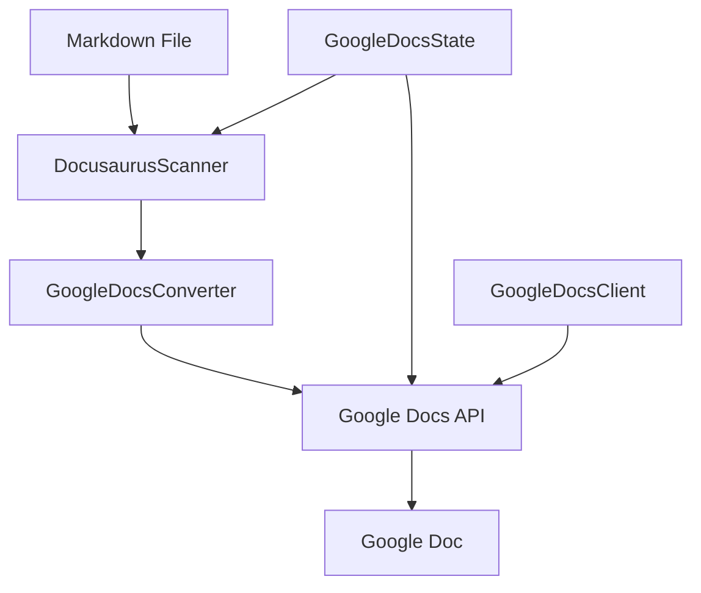

# Google Docs Integration

> Convert and sync Docusaurus markdown content to Google Docs.

## 🗂️ Directory Structure

```
gdocs/
├── google-docs-client.js     # Google OAuth2 & API client
├── google-docs-converter.js  # Markdown → Google Docs converter
├── google-docs-state.js      # State management
└── google-docs-sync.js       # Main sync orchestrator
```

## 📄 File Details

### 1. google-docs-client.js

**Purpose**: Handle authentication and communication with Google Docs API

```javascript
const client = new GoogleDocsClient();
await client.initialize(); // OAuth2 authentication
const doc = await client.createDocument("My Doc"); // Create new document
```

**Key Features**:
- OAuth2 PKCE authentication flow
- Token management (storage, refresh)
- Create and update Google Docs
- API connection testing

**Storage**:
- Tokens: `.docusaurus/google-tokens.json`
- Client ID & Secret: `.env`

### 2. google-docs-converter.js

**Purpose**: Convert markdown to Google Docs format

```javascript
const converter = new GoogleDocsConverter();
const requests = converter.convertFromMarkdown(markdownContent);
// requests = [{ insertText }, { updateTextStyle }, ...]
```

**Element Processing**:
- **Headings**: `# H1` → Font size 20pt, bold
- **Text Format**: 
  + `**bold**` → Bold text
  + `*italic*` → Italic text
  + `` `code` `` → Monospace font
- **Lists**:
  + Ordered: `1. Item`
  + Unordered: `- Item`
- **Code Blocks**: ` ```language ... ``` `
- **Links**: `[text](url)`

**Operation Flow**:
1. Parse markdown line by line
2. Identify element type
3. Create Google Docs API requests
4. Manage text index and formatting

### 3. google-docs-state.js

**Purpose**: Manage sync state

```javascript
const state = new GoogleDocsState();
await state.init();
if (await state.needsSync('file.md')) {
  // Sync file...
}
```

**State Storage Format**:
```json
{
  "lastSync": "2024-01-27T10:00:00Z",
  "rootDocumentId": "abc123",
  "documents": {
    "docs/intro.md": {
      "documentId": "xyz789",
      "lastModified": "2024-01-27T09:00:00Z"
    }
  },
  "stats": {
    "totalProcessed": 10,
    "created": 5,
    "updated": 3,
    "skipped": 2
  }
}
```

**Key Features**:
- Track file changes
- Map file paths → Google Doc IDs
- Sync statistics tracking
- Incremental sync support

### 4. google-docs-sync.js

**Purpose**: Orchestrate the entire sync process

```javascript
const sync = new GoogleDocsSync(client);
await sync.initialize();
await sync.syncDocs(); // Sync all docs/
// or
await sync.syncFile('docs/intro.md'); // Sync single file
```

**Sync Process**:
1. **Initialization**:
   - Load OAuth2 credentials
   - Test connection
   - Initialize state

2. **File Scanning**:
   - Find markdown files
   - Check for changes
   - Filter files needing sync

3. **File Processing**:
   - Parse markdown
   - Convert to Google Docs format
   - Upload to Google Docs
   - Update state

4. **Reporting**:
   - Files processed count
   - Success/failure stats
   - Sync duration

**Special Features**:
- Dry run mode (preview)
- Force sync option
- Progress tracking
- Error handling
- Auto recovery

## 🔄 Operation Flow



## 🛠️ Usage

1. **Setup OAuth2**:
```bash
# .env
GOOGLE_CLIENT_ID=your-client-id
GOOGLE_CLIENT_SECRET=your-client-secret
```

2. **Sync Files**:
```javascript
// Single file
docflu sync --gdocs --file docs/intro.md

// All docs
docflu sync --gdocs --docs

// Dry run
docflu sync --gdocs --docs --dry-run
```

## ⚠️ Known Limitations

1. **Images**:
   - No image upload support yet
   - Affects Mermaid diagrams rendering

2. **Tables**:
   - No markdown table support
   - Complex processing required

3. **Internal Links**:
   - Not feasible due to Google Docs limitations
   - All content in single document

4. **Content Organization**:
   - No tab hierarchy support
   - Alternative content organization needed

## 🔍 Debug Tips

1. **OAuth2 Issues**:
   - Check `.env` configuration
   - Delete `.docusaurus/google-tokens.json`
   - Re-run authentication

2. **Sync Failed**:
   - Check file modifications
   - Review sync state
   - Enable debug mode

3. **Content Issues**:
   - Verify markdown syntax
   - Check Google Docs API requests
   - Validate text indices

## 📚 References

- [Google Docs API](https://developers.google.com/docs/api)
- [OAuth 2.0 for Mobile & Desktop](https://developers.google.com/identity/protocols/oauth2/native-app)
- [Markdown-it Documentation](https://markdown-it.github.io/) 