# Complete Markdown Guide

This document demonstrates all supported markdown elements in Docusaurus.

## Table of Contents

- [Headings](#headings)
- [Text Formatting](#text-formatting)
- [Lists](#lists)
- [Tables](#tables)
- [Code](#code)
- [Quotes](#quotes)
- [Links](#links)
- [Images](#images)
- [File Attachments](#file-attachments)
- [Diagrams and Mermaid](#diagrams-and-mermaid)

- [Advanced Features](#advanced-features)

---

## Headings

# Heading 1
## Heading 2
### Heading 3
#### Heading 4
##### Heading 5
###### Heading 6

---

## Text Formatting

**Bold text** and __also bold__

*Italic text* and _also italic_

***Bold and italic*** and ___also bold and italic___

~~Strikethrough text~~

`Inline code`

Regular text with **bold**, *italic*, and `code` mixed together.

---

## Lists

### Unordered Lists

- Item 1
- Item 2
  - Nested item 2.1
  - Nested item 2.2
    - Deep nested item 2.2.1
- Item 3

* Alternative bullet style
* Another item
  * Nested with asterisk

### Ordered Lists

1. First item
2. Second item
   1. Nested ordered item
   2. Another nested item
3. Third item

### Task Lists

- [x] Completed task
- [ ] Incomplete task
- [x] Another completed task
- [ ] Another incomplete task

---

## Tables

### Basic Table

| Column 1 | Column 2 | Column 3 |
|----------|----------|----------|
| Row 1    | Data 1   | Value 1  |
| Row 2    | Data 2   | Value 2  |
| Row 3    | Data 3   | Value 3  |

### Aligned Table

| Left Aligned | Center Aligned | Right Aligned |
|:-------------|:--------------:|--------------:|
| Left         | Center         | Right         |
| Text         | Text           | Text          |
| More         | More           | More          |

### Complex Table

| Feature | Description | Status | Priority |
|---------|-------------|--------|----------|
| **Authentication** | User login system | ✅ Complete | High |
| **Dashboard** | Main user interface | 🚧 In Progress | High |
| **Reports** | Data visualization | ❌ Pending | Medium |
| **API** | REST endpoints | ✅ Complete | High |

---

## Code

### Inline Code

Use `console.log()` to print output in JavaScript.

### Code Blocks

```javascript
// JavaScript example
function greetUser(name) {
  console.log(`Hello, ${name}!`);
  return `Welcome, ${name}`;
}

const user = "John Doe";
greetUser(user);
```

```python
# Python example
def calculate_sum(numbers):
    """Calculate the sum of a list of numbers."""
    return sum(numbers)

numbers = [1, 2, 3, 4, 5]
result = calculate_sum(numbers)
print(f"Sum: {result}")
```

```bash
# Bash commands
npm install
npm start
git add .
git commit -m "Add new feature"
```

```json
{
  "name": "docusaurus-exam",
  "version": "0.0.0",
  "scripts": {
    "start": "docusaurus start",
    "build": "docusaurus build"
  }
}
```

---

## Quotes

> This is a simple blockquote.

> This is a blockquote with multiple lines.
> It continues on the next line.
> And even more lines.

> **Note:** This is an important blockquote with **bold** text.

> ### Quote with heading
> 
> This blockquote contains a heading and multiple paragraphs.
> 
> - It can also contain lists
> - And other markdown elements

---

## Links

### Basic Links

[Docusaurus Official Website](https://docusaurus.io/)

[GitHub Repository](https://github.com/facebook/docusaurus)

### Reference Links

This is a [reference link][1] and this is [another reference link][docusaurus].

[1]: https://docusaurus.io/
[docusaurus]: https://docusaurus.io/docs

### Internal Links

[Go to Introduction](./intro.md)

[Tutorial Basics](./tutorial-basics/create-a-document.md)

---

## Images

### Local Images from static/img


### Images with Alt Text and Title


### Public URI Images


### Responsive Images


---

## File Attachments

### Download Links

📄 [Download Sample Document](/files/sample-document.pdf)

⚙️ [Download Configuration File](/files/config.json)

### File References

You can reference files in your documentation:

- Configuration: [`config.json`](/files/config.json)
- Sample PDF: [`sample-document.pdf`](/files/sample-document.pdf)

---

## Diagrams and Mermaid

Docusaurus supports various diagram formats including Mermaid diagrams.

### Mermaid Flowchart


### Mermaid Sequence Diagram

```mermaid
sequenceDiagram
    participant D as Developer
    participant CLI as Docusaurus CLI
    participant S as Dev Server
    participant B as Browser

    D->>CLI: npm create docusaurus@latest
    CLI->>D: Site created ✓
    D->>CLI: npm run start
    CLI->>S: Start development server
    S->>B: Serve site on localhost:3000
    B->>D: Display site

    loop Development Cycle
        D->>D: Edit markdown files
        D->>S: Save changes
        S->>B: Hot reload
        B->>D: Show updated content
    end
```



### Mermaid Git Graph


### Mermaid Class Diagram


### Mermaid Entity Relationship Diagram


### Mermaid State Diagram


### Mermaid Pie Chart


### PlantUML Sequence Diagram


### Architecture Diagram (DOT/Graphviz)


### D2 System Overview

```d2
# Docusaurus Architecture
docs: {
  shape: rectangle
  label: "Documentation Files"
}

docusaurus: {
  shape: hexagon
  label: "Docusaurus Core"
}

build: {
  shape: diamond
  label: "Build Process"
}

output: {
  shape: cylinder
  label: "Static Site"
}

docs -> docusaurus: "Process"
docusaurus -> build: "Generate"
build -> output: "Deploy"

output -> browser: "Serve"
browser: {
  shape: person
  label: "User Browser"
}
```

### Front Matter

```yaml
---
id: my-doc-id
title: My document title
description: My document description
slug: /my-custom-url
sidebar_label: Custom Label
sidebar_position: 3
hide_title: false
hide_table_of_contents: false
pagination_label: Custom pagination
keywords: [docusaurus, markdown, features]
---
```

### Code Block Features

#### With Title

```javascript title="src/components/HelloWorld.js"
function HelloWorld() {
  return <h1>Hello, World!</h1>;
}
```

#### With Line Numbers

```jsx {1,4-6,11} showLineNumbers
import React from 'react';

function ButtonExample() {
  const handleClick = () => {
    alert('Button clicked!');
  };

  return (
    <div>
      <h1>My Component</h1>
      <button onClick={handleClick}>
        Click me!
      </button>
    </div>
  );
}
```

#### Multiple Language Examples

**JavaScript:**
```js
function helloWorld() {
  console.log('Hello, world!');
}
```

**Python:**
```py
def hello_world():
    print("Hello, world!")
```

**Java:**
```java
public class HelloWorld {
    public static void main(String[] args) {
        System.out.println("Hello, world!");
    }
}
```

### Document Metadata

```markdown
---
title: Page Title
description: Page description for SEO
keywords: [keyword1, keyword2, keyword3]
image: /img/custom-social-card.jpg
---
```

---

## Advanced Features

### Horizontal Rules

---

***

___

### Line Breaks

This is the first line.  
This is the second line with two spaces at the end of the previous line.

This is a paragraph.

This is another paragraph with a blank line above.

### Escape Characters

\*This text is not italic\*

\`This is not inline code\`

\# This is not a heading

### HTML Elements

<div style={{backgroundColor: '#f0f0f0', padding: '10px', borderRadius: '5px'}}>
  <strong>HTML Block:</strong> You can use HTML elements in Markdown.
</div>

<details>
<summary>Click to expand</summary>

This content is hidden by default and can be toggled.

- Hidden list item 1
- Hidden list item 2

</details>

### Emoji Support

😀 😃 😄 😁 😆 😅 😂 🤣

🚀 💻 📚 🔧 ⚡ 🎯 📈 🌟


---

## Conclusion

This document demonstrates the comprehensive markdown support available in Docusaurus. You can use all these elements to create rich, interactive documentation.

### Key Takeaways

1. **Headings** organize content hierarchically
2. **Lists** present information clearly
3. **Tables** display structured data
4. **Code blocks** show technical examples
5. **Images** enhance visual appeal
6. **Links** connect related content

> **Tip:** Always preview your markdown to ensure proper rendering!

---

*Last updated: 2024*

**Author:** Documentation Team 