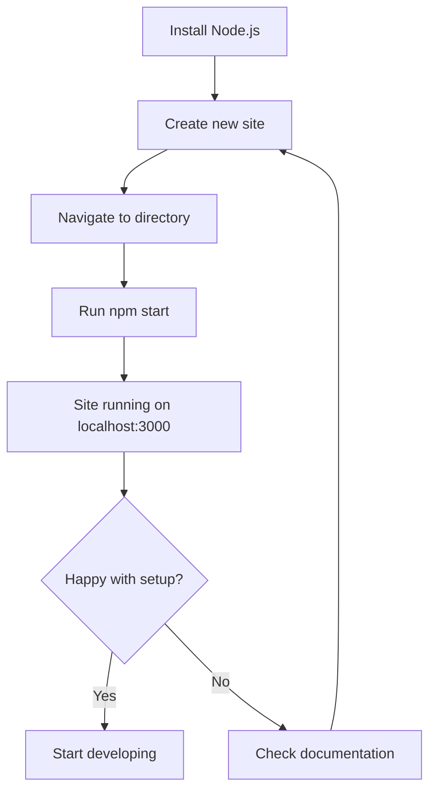
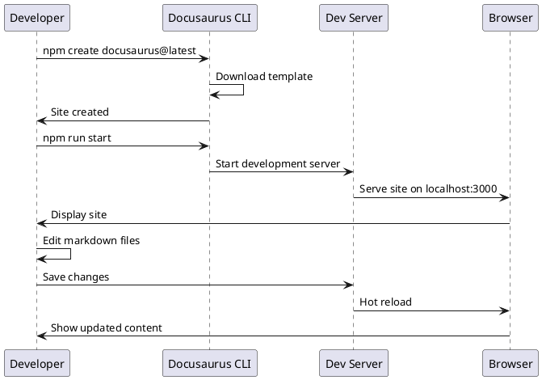
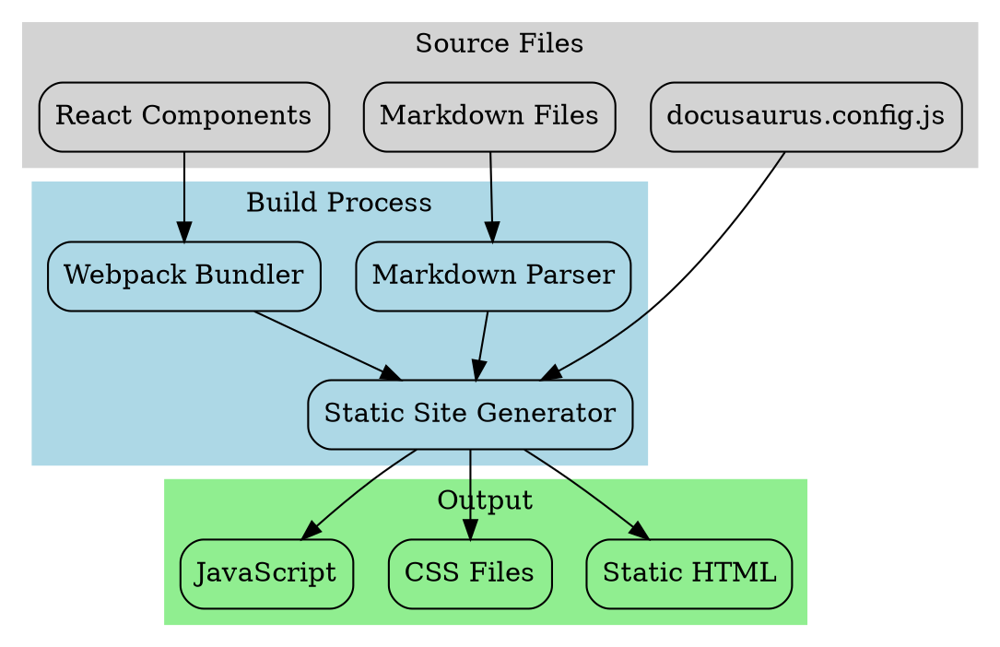

# Tutorial Intro

Let's discover **Docusaurus in less than 5 minutes**.

## Getting Started

Get started by **creating a new site**.

Or **try Docusaurus immediately** with **[docusaurus.new](https://docusaurus.new)**.

### What you'll need

- [Node.js](https://nodejs.org/en/download/) version 16.14 or above:
  - When installing Node.js, you are recommended to check all checkboxes related to dependencies.

## Generate a new site

Generate a new Docusaurus site using the **classic template**.

The classic template will automatically be added to your project after you run the command:

```bash
npm create docusaurus@latest my-website classic
```

You can type this command into Command Prompt, Powershell, Terminal, or any other integrated terminal of your code editor.

## Start your site

Run the development server:

```bash
cd my-website
npm run start
```

The `cd` command changes the directory you're working with. In order to work with your newly created Docusaurus site, you'll need to navigate the terminal there.

## Mermaid Diagram Example

Here's a simple Mermaid flowchart showing the setup process:



## PlantUML Sequence Diagram

Here's how the development process works:



## Architecture Diagram



## D2 System Overview

```d2
# Docusaurus Architecture
docs: {
  shape: rectangle
  label: "Documentation Files"
}

docusaurus: {
  shape: hexagon
  label: "Docusaurus Core"
}

build: {
  shape: diamond
  label: "Build Process"
}

output: {
  shape: cylinder
  label: "Static Site"
}

docs -> docusaurus: "Process"
docusaurus -> build: "Generate"
build -> output: "Deploy"

output -> browser: "Serve"
browser: {
  shape: person
  label: "User Browser"
}
```

That's it! Your site is now running and ready for development. 