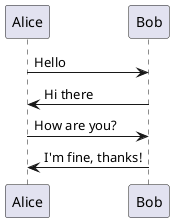
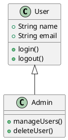
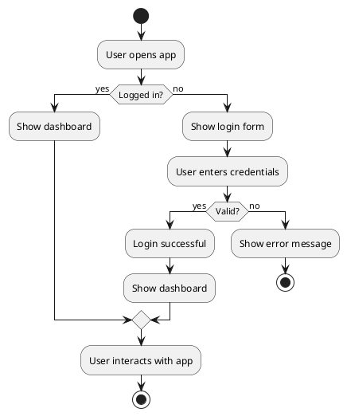

# PlantUML Test Document

This document contains PlantUML diagrams for testing.

## Simple Sequence Diagram

## Class Diagram

## Activity Diagram

This document should process all PlantUML diagrams correctly. 